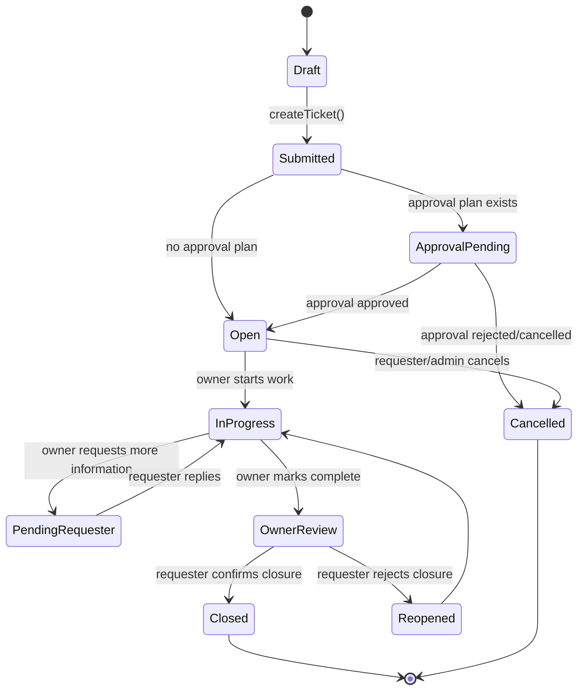
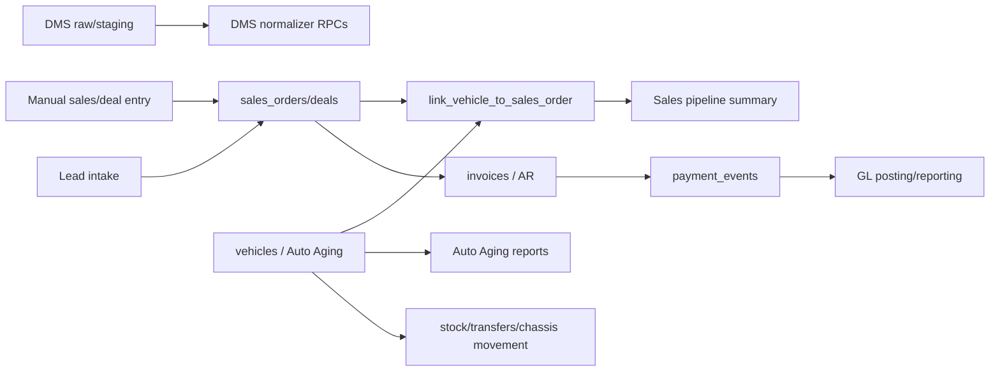
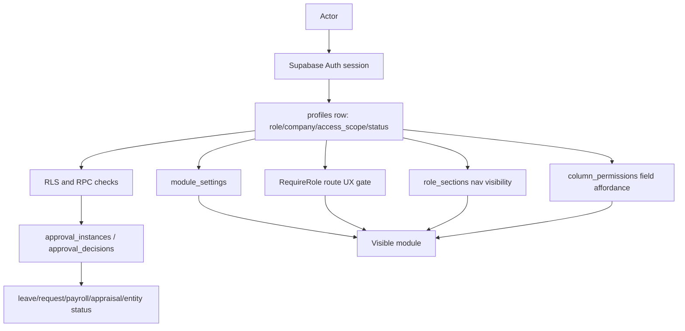
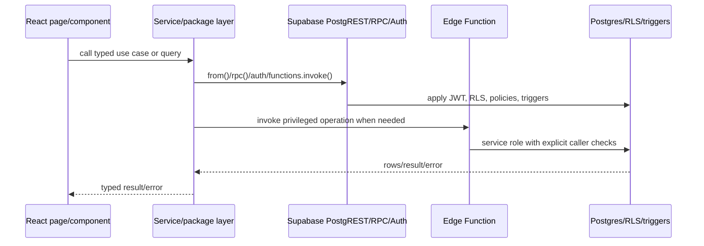
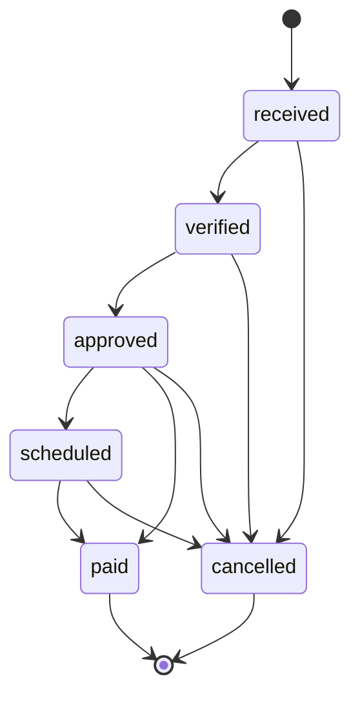
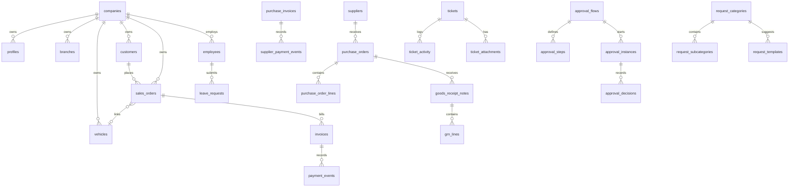

# UBS Modernization Analysis Report

Generated: 2026-07-08
Evidence policy: current code and migrations win over older planning docs when they disagree.
Scope: documentation-only modernization analysis. No runtime code, schema, API, migration, generated-type, or UI behavior changes are proposed as immediate edits in this report.

## 1. Executive Summary

UBS/FLC BI is an internal, SaaS-grade enterprise operations platform for Fook Loi group operations. The codebase is a TypeScript monorepo built around a Vite React main app, a dedicated HRMS web app, an HRMS mobile app, shared packages, and a Supabase backend with migrations, RLS policies, RPCs, storage, and edge functions.

Confirmed by code:
- The main web shell is rooted in `src/main.tsx`, with protected React Router routes for Platform, Auto Aging, Sales, Inventory, Purchasing, Accounts, Reports, Admin, HRMS redirect, and Internal Requests.
- Route metadata, module gates, navigation, smoke routes, and HRMS route metadata are centralized in `packages/shell/src/platformRegistry.ts`.
- Shared packages already exist for auth/access (`packages/auth`), shell metadata (`packages/shell`), Supabase client/types (`packages/supabase`), UI primitives (`packages/ui`), HRMS services (`packages/hrms-services`), internal-request services (`packages/internal-requests`), platform services (`packages/platform-services`), and shared types (`packages/types`).
- Supabase is the backend boundary: migrations in `supabase/migrations`, local stack config in `supabase/config.toml`, edge functions in `supabase/functions`, and RLS posture documented in `docs/RLS_MATRIX.md`.
- The current architecture is already mid-modernization. It has executable boundary checks in `package.json` and `scripts/check-*.ts` for route registry parity, RPC contracts, page data boundaries, workflow boundaries, UI ownership, auth ownership, HRMS ownership, internal-request ownership, and production smoke coverage.

Judgment:
- This system should not be rewritten from scratch. It should be modernized incrementally around the existing direction in `docs/ENTERPRISE_REARCHITECTURE.md`: main shell as canonical, RLS as security boundary, shared package ownership, canonical workflow runtime, registry-backed navigation, and production-safe additive rollout.
- The highest-value rearchitecture work is to finish extracting domain/business logic into package-owned services and use-case layers, retire legacy workflow paths, normalize service contracts, and reduce app-local duplication between root UBS and HRMS web.
- The highest-value product/UX work is to convert each module from route collections into role-aware operational workbenches: Home/Inbox as command center, Internal Requests as a complete service desk, Sales/Inventory/Purchasing/Accounts as lifecycle-driven workflows, and Admin as governance rather than a miscellaneous settings area.

Important inspection note:
- At analysis time the working tree was dirty. Uncommitted current-state inputs included `src/pages/tickets/*`, `src/components/tickets/*`, `src/services/ticketService.ts`, `src/lib/ticketSla.ts`, `packages/supabase/src/database.types.ts`, `packages/ui/src/index.ts`, `supabase/migrations/20260630000001_portal_redesign_phase2.sql`, the untracked `supabase/functions/auto-close-resolved-tickets/`, and untracked `supabase/migrations/20260630000002_portal_redesign_phase3.sql`. This report treats that dirty state as the inspected state, not as shipped production truth.

## 2. What This Project Is

Confirmed product identity:
- `README.md` names the project "FLC BI App" and describes a Vite React application backed by local Supabase.
- `vite.config.ts` PWA metadata names the app "FLC BI App" with description "FLC Business Intelligence & HRMS".
- `docs/ENTERPRISE_REARCHITECTURE.md` defines UBS as the canonical operating platform for Fook Loi group operations and explicitly says it is not public self-serve SaaS, but must be built with SaaS-grade tenant isolation and modularity.

Product type:
- Internal enterprise operations platform.
- B2B/internal SaaS-style system, not consumer B2C.
- Modules overlap CRM, ERP, HRMS, service desk, BI/reporting, finance operations, inventory, purchasing, workflow approvals, audit, and integration operations.

Likely users:
- Executives and directors: cross-module KPIs, financial reports, activity, audit, DMS/reconciliation visibility.
- General managers/managers: Sales, Auto Aging, Inventory, Purchasing, queue management, approvals.
- Sales team: deals, customers, lead intake, invoices, outstanding collection, sales advisors.
- Accounts users: GL, trial balance, P&L, balance sheet, aging, cash position, period close.
- HR/admin users: employees, leave, attendance, payroll, appraisals, HRMS settings.
- Portal/internal request users: submit requests, collaborate, track status, respond to owner follow-up.
- Company admins/super admins: users, module settings, role sections, master data, webhooks, DMS sync, reconciliation, health, audit.

Problems solved:
- Single sign-on workspace for company operations across sales, inventory, purchasing, finance, HR, service requests, and reporting.
- Tenant/company scoping and role-aware access over shared business data.
- Vehicle/order aging visibility and import/DMS reconciliation for automotive operations.
- Controlled internal request intake with routing, approvals, SLA, attachments, and collaboration.
- HRMS self-service and workforce admin.
- Finance/AP/AR/GL lifecycle reporting and controls.

Reasonable assumptions:
- "Fook Loi" is the operating group/customer because branding assets exist under `public/icons`, production URLs use `protonfookloi.com`, and docs call out Fook Loi.
- Automotive/dealer operations are core because domains include vehicles, chassis, DMS, dealer invoices, official receipts, GRN, purchase invoices, sales orders, and auto aging.

Unknowns:
- Exact production usage volume, number of tenants/companies, data retention policy, and formal business SLAs are not fully encoded in the repo.
- Whether all feature-flagged routes are enabled in production cannot be proven from code alone without current production feature flag rows.

## 3. Current Repository Map

| Area | Purpose | Evidence |
| --- | --- | --- |
| Root app | Main UBS React SPA | `src/main.tsx`, `src/pages`, `src/components`, `src/services` |
| Dedicated HRMS web | Separate hosted HRMS workspace | `apps/hrms-web/package.json`, `apps/hrms-web/src/App.tsx`, `apps/hrms-web/src/routes.ts` |
| HRMS mobile | Capacitor/Vite mobile self-service app | `apps/hrms-mobile/package.json`, `apps/hrms-mobile/src/App.tsx`, `apps/hrms-mobile/src/screens` |
| Shared auth/access | Auth context, role checks, permissions, profiles | `packages/auth/src/AuthContext.tsx`, `packages/auth/src/accessControl.ts`, `packages/auth/src/profileService.ts` |
| Shared shell | Route registry, module mapping, nav utilities | `packages/shell/src/platformRegistry.ts`, `packages/shell/src/moduleAccess.ts`, `packages/shell/src/hrmsWorkspace.ts` |
| Shared UI | shadcn/Radix primitives and enterprise components | `packages/ui/src`, `packages/ui/src/StandardTable.tsx`, `packages/ui/src/FilterBar.tsx` |
| Shared Supabase | Client, types, realtime hook | `packages/supabase/src/client.ts`, `packages/supabase/src/database.types.ts`, `packages/supabase/src/useSupabaseChannel.ts` |
| Shared types | Cross-domain TS types | `packages/types/src/auth.ts`, `packages/types/src/sales.ts`, `packages/types/src/hrms.ts`, `packages/types/src/gl.ts` |
| HRMS services | Leave, approvals, employees, payroll, attendance, settings | `packages/hrms-services/src/*` |
| Internal requests | Request categories, subcategories, templates, routing, approval orchestration | `packages/internal-requests/src/*` |
| Platform services | Audit, notifications, logging, branding, module settings, attachments, reports | `packages/platform-services/src/*` |
| Supabase backend | Migrations, functions, config, email templates | `supabase/migrations`, `supabase/functions`, `supabase/config.toml`, `supabase/templates` |
| E2E | Playwright module and smoke tests | `e2e/*.spec.ts`, `apps/hrms-web/e2e/hrms-web.spec.ts` |
| Unit tests | Vitest tests beside services/components | `src/services/*.test.ts`, `packages/*/src/*.test.ts`, `src/pages/**/*.test.tsx` |
| CI/CD | GitHub Actions, Docker, nginx, deploy scripts | `.github/workflows/ci.yml`, `.github/workflows/main-deploy.yml`, `Dockerfile`, `docker/nginx.conf`, `scripts/deploy-image.sh` |
| Docs | Architecture, security, release, phase plans, runbooks | `docs/ARCHITECTURE.md`, `docs/ENTERPRISE_REARCHITECTURE.md`, `docs/SECURITY.md`, `docs/ENV.md`, `docs/PHASE6_WEBHOOK_OUTBOX.md` |

Languages and runtimes:
- TypeScript and TSX for apps/packages.
- SQL for Supabase migrations.
- Deno TypeScript for Supabase Edge Functions.
- Bash for provisioning/deploy scripts.
- Node.js 20+ for build/test tooling.
- Nginx for production static bundle and Supabase same-origin proxy.

Package/build tools:
- npm workspaces in `package.json`.
- Vite 7 and React 18 for main and HRMS apps.
- Turbo config exists in `turbo.json`, but root scripts directly call Vite/tsx/Vitest.
- Vitest, Playwright, ESLint, TypeScript, Tailwind, Radix/shadcn, React Query, Supabase JS.

Important configuration:
- `src/config/env.ts` validates browser-safe env vars with Zod.
- `vite.config.ts` defines aliases, PWA config, manual chunks, Supabase proxy, and build behavior.
- `supabase/config.toml` defines auth URLs, signup disabled at platform level, email templates, and registered edge functions.
- `Dockerfile` builds static bundles and serves them through nginx.
- `docker/nginx.conf` handles SPA fallback, security headers, `/hrms/`, Supabase proxy routes, realtime websocket proxy, and health checks.

## 4. Current Architecture Map

Architecture style:
- Client-heavy modular SPA with Supabase as backend/API/database/auth.
- Backend logic is split between direct PostgREST table access, RPCs, triggers, RLS policies, storage policies, and edge functions.
- Domain logic is currently mixed across app-local services and extracted packages.
- Route-level UI uses React Router lazy-loaded pages and React Query for cache/server state.

Confirmed layers:
- Presentation: `src/pages`, `src/components`, `apps/hrms-web/src/pages`, `apps/hrms-web/src/components`.
- Shell/navigation: `src/components/layout/app-shell/*` consumes `@flc/shell`.
- Contexts/composition: `src/contexts/AuthContext.tsx`, `src/contexts/DataContext.tsx`, `src/contexts/ModuleAccessContext.tsx`, `src/contexts/BrandingContext.tsx`, `src/contexts/SalesContext.tsx`.
- Services/data access: `src/services/*`, `packages/*/src/*Service.ts`.
- Database/API: Supabase tables, RLS, RPCs, edge functions.
- Cross-cutting: `@flc/platform-services`, Sentry via `errorTrackingService`, web vitals via `src/services/webVitalsService.ts`.

Architecture diagram:

```mermaid
flowchart LR
  User[User browser or mobile app]
  Main[Main UBS React app\nsrc/main.tsx]
  HRMS[Dedicated HRMS web\napps/hrms-web]
  Mobile[HRMS mobile\napps/hrms-mobile]
  Shell[@flc/shell\nroute registry]
  Auth[@flc/auth\nAuthContext/access]
  UI[@flc/ui\nshared primitives]
  Domain[Domain services\nsrc/services + packages]
  Supabase[(Supabase\nAuth/PostgREST/RPC/RLS/Storage)]
  Edge[Edge functions\nsupabase/functions]
  Nginx[Nginx static + same-origin proxy]

  User --> Nginx
  Nginx --> Main
  Nginx --> HRMS
  Mobile --> Supabase
  Main --> Shell
  Main --> Auth
  Main --> UI
  HRMS --> Shell
  HRMS --> Auth
  HRMS --> UI
  Main --> Domain
  HRMS --> Domain
  Mobile --> Domain
  Domain --> Supabase
  Domain --> Edge
  Edge --> Supabase
```

Healthy architecture choices already present:
- Route metadata is centralized in `packages/shell/src/platformRegistry.ts`.
- Presentation surfaces are blocked from direct Supabase access by `scripts/check-page-data-boundary.ts`.
- Auth/access behavior is package-owned by `@flc/auth` and guarded by `scripts/check-auth-service-boundary.ts`.
- Internal-request configuration and approval orchestration are package-owned by `@flc/internal-requests` and guarded by `scripts/check-internal-request-service-boundary.ts`.
- Legacy `approval_requests` access is confined by `scripts/check-workflow-boundary.ts`.
- Production smoke routes are registry-backed through `scripts/check-production-smoke-registry.ts`.

Current architectural weaknesses:
- Router elements still live manually in `src/main.tsx`, while metadata lives in `platformRegistry`. This is acceptable short-term but creates parity work.
- Many core business services remain in `src/services` and call Supabase directly. This is allowed by current rules, but it leaves domain boundaries uneven.
- HRMS web still has duplicated local service files and app-local wrappers, though checks and docs indicate extraction is underway.
- Generated database types lag some migrations in places; comments in `src/services/ticketService.ts` and `packages/internal-requests/src/requestApprovalService.ts` mention local row/type shims for newer columns.
- Some business workflows span frontend state, service calls, RPCs, triggers, and notifications without a single use-case boundary.

## 5. Current Feature Map

| Domain | Features | Roles | Frontend evidence | Service/backend evidence | Main risks | Improvement |
| --- | --- | --- | --- | --- | --- | --- |
| Auth/account | Login, signup/invite callback, forgot/reset password, pending account, protected routes | All users, admins | `src/pages/LoginPage.tsx`, `SignUpPage.tsx`, `ResetPasswordPage.tsx`, `AccountPending.tsx`, `src/main.tsx` | `packages/auth/src/authService.ts`, `authFlows.ts`, `AuthContext.tsx`, `supabase/functions/invite-user`, `delete-user`, `update-user-status` | Client routes are UX only; invite edge function holds admin rules | Keep package-owned auth, add end-to-end invite/deactivate/reactivate scenarios |
| Identity/access | App roles, access scopes, portal-only routing, role sections, module toggles, column permissions | Super admin, company admin, directors, managers, sales, accounts, portal roles | `RequireRole` in `src/main.tsx`, `ModuleAccessProvider`, `useRoleSectionMatrix`, `useColumnPermissions` | `packages/auth/src/accessControl.ts`, `rolePermissions.ts`, `permissionService.ts`, `roleSectionService.ts`, `module_settings`, `role_sections`, `column_permissions` | Many access concepts can be confused | Publish a single access decision table and keep RLS as authority |
| Platform Home/Inbox | Role-aware home, unified inbox, notifications, global search | All app users | `src/pages/Home.tsx`, `src/pages/Inbox.tsx`, `src/pages/Notifications.tsx`, app shell topbar | `src/services/kpiHomeService.ts`, `inboxService.ts`, `globalSearchService.ts`, `packages/platform-services/src/notificationService.ts`, `global_search()` | Feature flags may hide capabilities; Home can become launcher-heavy | Make Home a command center with real attention queues and KPIs |
| Auto Aging | Dashboard, vehicle explorer/detail/lifecycle, import center, review queue, SLA, mappings, commissions, reports, data quality | Managers and up for admin/import, broader read access | `src/pages/auto-aging/*` | `src/services/vehicleService.ts`, `importService.ts`, `importReviewService.ts`, `mappingService.ts`, `commissionService.ts`, migrations for `vehicles`, `import_batches`, `import_review_rows`, `sla_policies`, RPCs `search_vehicles`, `commit_import_batch`, `auto_aging_report` | Import and report logic spans parsers, services, RPCs, tables | Create an Auto Aging package with import, review, lifecycle, reporting use cases |
| Sales/CRM | Dashboard, pipeline, deals, new deal, deal detail, customers, lead intake, performance, margin, outstanding, dealer invoices, OR verification, advisors | Sales, managers, executives, accounts | `src/pages/sales/*` | `src/services/salesOrderCrudService.ts`, `salesPipelineService.ts`, `dealService.ts`, `leadIntakeService.ts`, `customerService.ts`, migrations for `sales_orders`, `customers`, `deal_stages`, `lead_followups`, `dealer_invoices`, `official_receipts` | Legacy order/deal terminology coexists; lifecycle rules partly split | Define Sales domain language: lead -> deal/order -> vehicle -> invoice/receipt |
| Inventory | Stock balance, advanced chassis search, vehicle transfers, chassis movement | Inventory users, managers | `src/pages/inventory/*` | `src/services/inventoryService.ts`, `vehicleService.ts`, migrations for `vehicle_transfers`, `vehicles`, transfer webhook events | Transfer side effects include audit and webhooks; rules need centralization | Move transfer lifecycle into inventory use-case service and emit events consistently |
| Purchasing | Purchase invoices, PO, PO detail, GRN, GRN detail, three-way match | Managers and purchasing users | `src/pages/purchasing/*` | `src/services/purchaseOrderService.ts`, `grnService.ts`, `purchaseInvoiceService.ts`, `threeWayMatchService.ts`, RPCs `create_purchase_order`, `transition_po_status`, `create_grn`, `get_three_way_match_queue` | PO/GRN/PI lifecycle depends on RPCs and page flows | Make purchasing workflow state machines explicit and tested |
| Accounts/Finance | Chart, periods, trial balance, P&L, balance sheet, aging by branch, cash position, period close, journal | Accounts and above | `src/pages/accounts/*` | `src/services/glService.ts`, `apService.ts`, `invoiceService.ts`, migrations `accounts`, `accounting_periods`, `journal_entries`, `payment_events`, `supplier_payment_events`, reporting RPCs | Financial invariants must stay backend-enforced | Keep immutable ledgers and transition RPCs; add financial contract tests |
| HRMS | Dashboard, leave, approvals, appraisals, announcements, profile, attendance, team leave, employees, payroll, settings | Employees, managers, HR/admin, payroll | `apps/hrms-web/src`, `src/pages/hrms/LeaveManagement.tsx`, `apps/hrms-mobile/src/screens` | `packages/hrms-services/src/*`, `src/services/hrms/*`, migrations for `employees`, `leave_requests`, `leave_balances`, `attendance_records`, `payroll_*`, `appraisals`, `approval_instances` | Dedicated HRMS host and main app still share/duplicate pieces | Finish HRMS package extraction and make web/mobile consume the same services |
| Internal Requests | Portal landing, new request, my/pending/completed requests, workspace, manager dashboard, queue, history, reports, setup, announcements, documents | Portal users, portal admins, company admins | `src/pages/tickets/*`, `src/components/layout/CustomerServiceLayout.tsx`, `src/pages/tickets/NewTicket.tsx` | `src/services/ticketService.ts`, `@flc/internal-requests`, `portalAnnouncementService.ts`, `portalDocumentService.ts`, migrations for `tickets`, `ticket_activity`, `ticket_attachments`, `request_categories`, `request_subcategories`, `request_templates`, `request_routing_rules`, `request_form_fields`, `ticket_collaborators` | Ticket logic is rich and spread across service, package, migrations, dirty WIP files | Promote service-desk use cases: submit, route, approve, assign, collaborate, resolve, close |
| Admin/governance | Users, audit, health, settings, branches, master data, suppliers, dealers, user groups, activity, KPI studio, DMS sync, reconciliation, webhooks | Admin, director, company admin, super admin | `src/pages/admin/*` | `profileService`, `auditService`, `systemHealthService`, `dmsService`, `reconciliationService`, `webhookOutboxService`, `masterDataService` | Admin IA mixes governance, master data, ops consoles | Split Admin into Access, Company Setup, Integration Ops, Audit/Health |
| Integrations/events | DMS staging, normalizers, reconciliation, webhook outbox, push notifications, scheduled reports, Google Sheets import | Admin/operators; some user-triggered producers | `src/pages/admin/DmsSyncOps.tsx`, `WebhookOutbox.tsx`, e2e specs | `supabase/functions/dms-sync-worker`, `webhook-deliverer`, `send-push-notification`, `src/services/dmsService.ts`, `webhookOutboxService.ts`, `scheduledReportService.ts` | Some integrations are skeleton/read-only; secrets must stay server-side | Formalize integration adapter layer and operational runbooks |

## 6. Current Business Flow Map

### Main user journey

```mermaid
flowchart TD
  Start[Open app] --> Auth{Authenticated?}
  Auth -- no --> Welcome[/welcome or /login]
  Welcome --> Login[Supabase auth]
  Auth -- yes --> Profile{Profile active?}
  Profile -- pending/inactive --> Pending[/account-pending]
  Profile -- active --> PortalOnly{Portal-only?}
  PortalOnly -- portal role --> Portal[/portal]
  PortalOnly -- HRMS only --> HRMS[/hrms or dedicated HRMS URL]
  PortalOnly -- no --> Home[/home role-aware workspace]
  Home --> ModuleGate{Module active?}
  ModuleGate -- no --> Unavailable[Unavailable state]
  ModuleGate -- yes --> RoleGate{Route role allowed?}
  RoleGate -- no --> Unauthorized[Unauthorized state]
  RoleGate -- yes --> Work[Module workflow]
```

Evidence:
- Auth/profile routing is in `src/main.tsx` via `ProtectedAppShell`, `ProtectedRoute`, `isPortalOnlyUser`, `hasPortalSpecificRole`, and HRMS workspace helpers.
- Role gates are `RequireRole` route wrappers in `src/main.tsx`.
- Module gates are `RequireActiveModule` via `withModuleAccess()`.
- Module/route metadata is in `packages/shell/src/platformRegistry.ts`.

### Internal request lifecycle



Evidence:
- Ticket status types and fields are in `src/services/ticketService.ts`.
- New request intake uses `src/pages/tickets/NewTicket.tsx` and `src/pages/tickets/new-ticket/NewTicketSections.tsx`.
- Approval planning uses `getInternalRequestApprovalPlan` from `@flc/internal-requests`.
- Categories, subcategories, templates, custom fields, routing, attachments, SLA, collaboration, and activity have migrations under `supabase/migrations/20260417000001_migration_tickets.sql`, `20260430060000_add_request_category_management.sql`, `20260502010000_add_request_templates.sql`, `20260507003000_add_request_custom_form_fields.sql`, `20260508093000_request_sla_framework.sql`, `20260619100000_internal_request_phase2_collaboration.sql`, and `20260630000000_portal_redesign_phase1.sql`.
- Dirty current-state migration `20260630000001_portal_redesign_phase2.sql` adds ticket reply/reassign/auto-close functions, and untracked `20260630000002_portal_redesign_phase3.sql` adds collaborator access helper.

### Sales/order/vehicle data flow



Evidence:
- `src/services/salesPipelineService.ts` calls `transition_sales_order_stage`, `get_sales_pipeline_summary`, `link_vehicle_to_sales_order`, and `unlink_vehicle_from_sales_order`.
- Vehicle/auto-aging RPCs are in migrations such as `20260421130000_phase2_vehicle_rpcs.sql`, `20260510140000_auto_aging_report_rpc.sql`, and `20260510150000_auto_aging_source_ledger.sql`.
- DMS staging is created by `20260510120000_dms_legacy_sync_foundation.sql`; worker skeleton is `supabase/functions/dms-sync-worker/index.ts`.
- AR ledger invariants are in `20260511100000_ar_foundation.sql`.

### Approval authorization flow



Evidence:
- Access concepts are documented in `docs/ROLE_MODEL.md`.
- App roles and scopes are in `packages/types/src/auth.ts`.
- Default role sections are in `packages/auth/src/rolePermissions.ts`.
- Shared access helpers are in `packages/auth/src/accessControl.ts`.
- RLS boundary is documented in `docs/SECURITY.md` and `docs/RLS_MATRIX.md`.
- Canonical workflow direction is in `docs/ENTERPRISE_REARCHITECTURE.md` and implemented in `packages/hrms-services/src/approval/approvalEngine.ts` plus `packages/internal-requests/src/requestApprovalService.ts`.

### Supabase/client/edge-function interaction



Evidence:
- Presentation surfaces are blocked from direct Supabase access by `scripts/check-page-data-boundary.ts`.
- Edge functions include `invite-user`, `delete-user`, `update-user-status`, `send-push-notification`, `rollover-leave-balances`, `dms-sync-worker`, `webhook-deliverer`, and dirty untracked `auto-close-resolved-tickets`.
- Edge function registration is in `supabase/config.toml`.

### AP/finance lifecycle



Evidence:
- `docs/ARCHITECTURE.md` documents the immutable AP/AR ledger pattern.
- `src/services/apService.ts` calls `record_supplier_payment_event`, `reverse_supplier_payment_event`, `get_supplier_payment_events`, `get_ap_aging_summary`, `get_ap_aging_by_branch`, and `transition_pi_lifecycle`.
- AP SQL invariants are in `supabase/migrations/20260511110000_ap_foundation.sql`.

## 7. Current Data Model

Core entities:

| Entity | Represents | Key fields/relationships | Lifecycle/rules | Evidence |
| --- | --- | --- | --- | --- |
| `companies` | Tenant/company boundary | `id`, `name`, `code`; referenced by most company-scoped rows | Super-admin/company-scoped access | `20260415013514_migration_8de8962b.sql`, `docs/RLS_MATRIX.md` |
| `profiles` | Auth profile and app identity | `id`, `email`, `role`, `company_id`, `branch_id`, `employee_id`, `access_scope`, `status`, `portal_access_only` | Created by `handle_new_user`; admin-managed via edge functions/services | `packages/auth/src/profileService.ts`, `supabase/functions/invite-user` |
| `branches` | Company branch | `company_id`, `code`, `name`; used for branch scope, vehicles, sales | Admin-managed master data | `src/services/branchService.ts`, `masterDataService.ts` |
| `module_settings` | Company module toggles | `company_id`, module status/config | Drives `RequireActiveModule` UX | `packages/platform-services/src/moduleSettingsService.ts`, `packages/shell/src/platformRegistry.ts` |
| `role_sections` | Role-to-section visibility | `company_id`, `role`, `sections` | Admin-managed section permission matrix | `packages/auth/src/roleSectionService.ts` |
| `column_permissions` | Field-level permissions | role/table/column metadata | Client affordance plus DB enforcement | `packages/auth/src/permissionService.ts`, `docs/SECURITY.md` |
| `vehicles` | Vehicle/chassis inventory and aging subject | `company_id`, `chassis_no`, branch/model/status/stage fields | Import, lifecycle, stock, transfer, sales link, aging stage | `src/services/vehicleService.ts`, Auto Aging migrations |
| `import_batches` / `import_review_rows` | Auto Aging import pipeline | batch metadata, rows, quality | `commit_import_batch` and review queue | `src/services/importService.ts`, `importReviewService.ts` |
| `customers` | Customer records | company-scoped details, links to orders/invoices | Created from sales/DMS/manual flows | `src/services/customerService.ts`, DMS customer normalizer |
| `sales_orders` / deals | Sales/deal lifecycle | customer, vehicle link, stage, branch, value | Stage transitions through RPC; vehicle link RPC | `src/services/salesOrderCrudService.ts`, `salesPipelineService.ts` |
| `deal_stages` | Sales pipeline stages | company-scoped ordered stages | Admin/setup-managed | `src/services/dealStageService.ts` |
| `invoices` / `payment_events` | AR invoice and immutable payment ledger | invoice totals, payment event rows, reversals | Payment status recomputed by triggers/RPC | `src/services/invoiceService.ts`, `20260511100000_ar_foundation.sql` |
| `purchase_orders` / lines | Purchasing commitments | PO header, lines, supplier | Created and transitioned by RPC | `src/services/purchaseOrderService.ts` |
| `goods_receipt_notes` / `grn_lines` | Receiving against PO | GRN header/lines and PO references | `create_grn`; later migration auto-updates stock | `src/services/grnService.ts`, `20260624010000_grn_auto_stock.sql` |
| `purchase_invoices` / `supplier_payment_events` | AP invoice and immutable payment ledger | supplier invoice, lifecycle status, payment events | Lifecycle via `transition_pi_lifecycle`; payment RPCs enforce state | `src/services/apService.ts`, `purchaseInvoiceService.ts` |
| GL tables | Chart, periods, journals | `accounts`, `accounting_periods`, `journal_entries`, `journal_entry_lines` | Balance validation, posting RPCs, reporting RPCs | `src/services/glService.ts`, `20260514200000_gl_foundation.sql` |
| HRMS employee/workforce | Employees and assignments | `employees`, `employee_module_assignments`, `hrms_roles`, `employee_hrms_role_assignments` | HRMS access and approval routing | `packages/hrms-services/src/employee/employeeService.ts`, `settingsService.ts` |
| Leave/attendance/payroll/appraisal | HR workflows | `leave_requests`, `leave_balances`, `attendance_records`, `payroll_runs`, `payroll_items`, `appraisals`, `appraisal_items` | Approval instances, rollover, self/manager permissions | `packages/hrms-services/src/leave/leaveService.ts`, `payrollService.ts`, `appraisalService.ts` |
| `approval_flows` / `approval_steps` | Workflow definitions | entity type, department, routing, approver role/user | Admin-managed workflow setup | `packages/hrms-services/src/settings/settingsService.ts` |
| `approval_instances` / `approval_decisions` | Canonical workflow runtime | entity type/id, requester, current step, decision history | Submit, approve, reject, resubmit, advance | `packages/hrms-services/src/approval/approvalEngine.ts`, `packages/internal-requests/src/requestApprovalService.ts` |
| `approval_requests` | Legacy workflow runtime | older approval rows | Compatibility only | `src/services/approvalEngineService.ts`, `scripts/check-workflow-boundary.ts` |
| `tickets` | Internal request/service desk item | requester, owner, category/subcategory, priority, status, SLA, approval, collaboration | Submit, route, approve, assign, collaborate, resolve, close/reopen/cancel | `src/services/ticketService.ts`, tickets migrations |
| Request configuration | Portal setup metadata | `request_categories`, `request_subcategories`, `request_templates`, `request_form_fields`, `request_routing_rules`, `request_attachment_settings`, `request_module_settings` | Portal/admin setup drives intake and routing | `packages/internal-requests/src/*` |
| Ticket collaboration | Portal collaboration | `ticket_activity`, `ticket_chat_reads`, `ticket_internal_notes`, `ticket_closure_feedback`, `ticket_duplicate_links`, `ticket_collaborators` | Comments, internal notes, duplicate links, collaborator access | `20260619100000_internal_request_phase2_collaboration.sql`, dirty `20260630000002_portal_redesign_phase3.sql` |
| DMS staging | External DMS import evidence | `sync_runs`, `dms_raw_*`, `normalizer_column_authority`, reconciliation tables | Raw first, normalize/reconcile later | `supabase/functions/dms-sync-worker`, DMS migrations |
| Webhooks | Event subscriptions and delivery queue | `webhook_endpoints`, `webhook_outbox` | Producers emit via RPC; edge worker delivers/retries | `docs/PHASE6_WEBHOOK_OUTBOX.md`, `supabase/functions/webhook-deliverer` |

Current data model summary:
- The database is broad but coherent around tenant-scoped tables with `company_id`, RLS, RPCs for high-risk workflows, and append-only event tables for ledgers/audit-style events.
- There is some historical drift: early migrations had broad/anon policies later hardened by hotfixes, older workflow tables remain, and generated TS types lag newer migrations.
- Business-critical consistency increasingly lives in database RPCs/triggers: import commits, vehicle search, pipeline transitions, ledgers, AP lifecycle, reports, DMS ops, reconciliation, PO/GRN/3-way match, and ticket functions.

Entity relationship map:



Data model problems:
- Table ownership is not always reflected in package boundaries. Example: Finance has AP/GL/AR logic in `src/services`, while HRMS and Internal Requests are partly package-owned.
- Workflow has both `approval_instances` and legacy `approval_requests`.
- `sales_orders`, deals, and sales lifecycle naming need a canonical vocabulary.
- Generated Supabase types need a regular update process after migrations to remove local row shims.
- Integration staging and canonical records need clearer lineage/audit documentation.

Suggested improved data model:
- Keep current table names unless migration value is clearly higher than compatibility cost.
- Add a domain ownership registry mapping tables/RPCs to packages/use cases.
- Make canonical workflow tables explicit: `approval_flows`, `approval_steps`, `approval_instances`, `approval_decisions`.
- Add versioned contract tests for high-risk RPCs and event tables.
- Keep raw DMS staging immutable and use normalizer/reconciliation tables as explicit provenance before canonical writes.
- For tickets, consolidate status/responsible-party/SLA transitions behind RPCs or a service-desk workflow service.

Migration considerations:
- Avoid destructive table cleanup early.
- Add views/adapters for old names where needed.
- Backfill generated types before removing local shims.
- Feature-flag any route behavior or workflow transition changes.
- Use RLS matrix and production smoke before and after every domain migration.

## 8. Current API and Integration Map

Client APIs:
- Supabase Auth/PostgREST/RPC via `@supabase/supabase-js`, wrapped by `packages/supabase/src/client.ts` and service layers.
- React Query cache boundary in pages/contexts. `src/main.tsx` uses `QueryClientProvider` from `src/lib/queryClient`.
- Realtime subscriptions via `@flc/supabase/useSupabaseChannel` and package/app hooks such as `useTicketsRealtime`.

RPCs and functions:
- Auto Aging: `commit_import_batch`, `search_vehicles`, `vehicle_kpi_summary`, `auto_aging_dashboard_summary`, `auto_aging_report`, `auto_aging_source_ledger`.
- Sales: `transition_sales_order_stage`, `get_sales_pipeline_summary`, `get_sales_dashboard_summary`, `link_vehicle_to_sales_order`, `unlink_vehicle_from_sales_order`, `get_leads_feed`, `get_lead_detail`, `add_lead_followup`.
- Finance/AP/AR/GL: `record_payment_event`, `reverse_payment_event`, `get_payment_events`, `get_ar_aging_summary`, `record_supplier_payment_event`, `reverse_supplier_payment_event`, `get_supplier_payment_events`, `get_ap_aging_summary`, `transition_pi_lifecycle`, `get_trial_balance`, `get_profit_loss`, `get_balance_sheet`, `get_cash_position`, period close RPCs.
- Purchasing: `create_purchase_order`, `transition_po_status`, `create_grn`, `get_po_line_receipts`, 3-way match RPCs.
- DMS/Reconciliation: `get_dms_sync_runs_summary`, `get_dms_raw_staging_counts`, `mark_sync_run_for_retry`, `get_reconciliation_queue`, `decide_reconciliation_match`, related detail/count RPCs.
- Platform: `global_search`, `get_role_home_kpis`, `upsert_role_kpi_defaults`, `bump_rate_limit`.
- Webhooks: `emit_webhook_event`, `upsert_webhook_endpoint`, `requeue_webhook_delivery`.
- Tickets: `cancel_own_ticket`, `ticket_reply_and_wait`, `reassign_ticket`, `auto_close_resolved_tickets`, `is_ticket_collaborator` in current dirty migrations.

Edge functions:
- `invite-user`: admin invite with rate limit, role/scope/company validation, branch validation.
- `delete-user`: invited user cleanup.
- `update-user-status`: deactivate/reactivate auth account.
- `send-push-notification`: push delivery with same-company target checks.
- `rollover-leave-balances`: yearly leave-balance rollover for admin callers.
- `dms-sync-worker`: backend-only DMS staging skeleton; currently persists caller-supplied raw records.
- `webhook-deliverer`: outbox delivery with HMAC signing, retries, and admin/service-role authorization.
- `auto-close-resolved-tickets`: untracked current-state function; should be documented/validated before shipping.

External integrations:
- Supabase Auth/Postgres/Storage/Realtime/Edge Runtime.
- Proton DMS endpoints are documented through `docs/ENV.md` and mapped in `supabase/functions/dms-sync-worker/index.ts`.
- Google Sheets import support appears in `vite.config.ts` CSP and Auto Aging docs/services.
- Sentry browser error tracking via `VITE_SENTRY_DSN`, `@sentry/react`, and `errorTrackingService`.
- Push notifications through push tokens/subscriptions and `send-push-notification`.
- Webhook receivers via `webhook_outbox`.
- Cloudflare Access/SSH deploy path in `.github/workflows/main-deploy.yml`.
- Resend/SMTP for Supabase auth emails through `scripts/configure-supabase-auth-smtp.sh` and `supabase/config.toml`.

## 9. Current User Roles and Permissions

App roles:
- Defined in `packages/types/src/auth.ts`: `super_admin`, `company_admin`, `director`, `general_manager`, `manager`, `sales`, `accounts`, `analyst`, `creator_updater`, `portal_admin`, `portal_staff`.

Access scopes:
- `self`, `branch`, `company`, `global` in `packages/types/src/auth.ts`.

Permission layers:
1. Supabase Auth: establishes session identity.
2. Profile status/company/access scope: stored on `profiles`.
3. RLS: authoritative tenant/row boundary.
4. Module toggles: `module_settings` and `RequireActiveModule`.
5. Route roles: `RequireRole` wrappers in `src/main.tsx`.
6. Section permissions: `role_sections`, consumed through `useRoleSectionMatrix`.
7. Column permissions: `column_permissions`, consumed through `useColumnPermissions` and enforced by backend constraints/RPCs per docs.

Portal roles:
- `portal_admin` and `portal_staff` are in `APP_ROLES`.
- `packages/auth/src/accessControl.ts` defines `PORTAL_QUEUE_ROLES` and `PORTAL_SETUP_ROLES` as `super_admin`, `company_admin`, and `portal_admin`.
- `docs/ROLE_MODEL.md` notes portal roles are internal-request/customer-portal roles, not HRMS roles or general hierarchy roles.

HRMS workflow roles:
- HRMS roles are separate records in `hrms_roles` and `employee_hrms_role_assignments`.
- They drive leave, payroll, appraisal, and workflow participation rather than global app entry.

Weaknesses:
- Access concepts are numerous and easy to conflate.
- Some roles can see Admin section defaults for personal settings while admin-only functionality is internally gated. This is intentional in `src/main.tsx` for `/admin/settings`, but it needs documentation in the UI/admin guide.
- Route gates are UX only; every future plan must avoid treating them as security.

Recommendation:
- Keep `docs/ROLE_MODEL.md` as the access glossary and update it whenever new roles/scopes are added.
- Add policy/use-case tests for each sensitive action, not only route tests.

## 10. Current Business Logic Map

Where logic lives today:

| Layer | Examples | Assessment |
| --- | --- | --- |
| UI/page logic | `src/pages/tickets/NewTicket.tsx` handles draft restore/save, category/subcategory selection, attachment validation, duplicate review, approval preview, route blocking | Acceptable for UI orchestration, but business transition rules should move behind use cases |
| App-local services | `src/services/ticketService.ts`, `salesPipelineService.ts`, `apService.ts`, `inventoryService.ts`, `glService.ts` | Main active business logic layer for many UBS domains |
| Package services | `@flc/auth`, `@flc/internal-requests`, `@flc/hrms-services`, `@flc/platform-services` | Correct target direction; uneven domain coverage |
| RPCs/triggers | `transition_pi_lifecycle`, ledger recompute triggers, `commit_import_batch`, `transition_sales_order_stage`, `create_grn` | Strong for atomic workflows and invariants |
| RLS/policies | `docs/RLS_MATRIX.md`, migrations | Primary security boundary |
| Edge functions | `invite-user`, `rollover-leave-balances`, `dms-sync-worker`, `webhook-deliverer` | Correct home for privileged/server-only operations |
| Boundary scripts | `scripts/check-page-data-boundary.ts`, `check-workflow-boundary.ts`, `check-auth-service-boundary.ts` | Valuable architecture-as-code guardrails |

Business rules already visible:
- Public signup disabled; users onboarded via admin invite (`supabase/config.toml`, `supabase/functions/invite-user`).
- New auth users default to pending/creator-updater behavior via `handle_new_user` migrations and docs.
- Company admins cannot invite users into another company or grant global/super-admin access (`invite-user`).
- Pages/components must not call Supabase directly (`scripts/check-page-data-boundary.ts`).
- RLS is the authority for tenant isolation (`docs/SECURITY.md`, `docs/RLS_MATRIX.md`).
- AP payment recording requires purchase invoice lifecycle `approved` or `scheduled`; transition rules are in `transition_pi_lifecycle`.
- AR/AP ledgers are append-only and recompute parent paid/payment status through triggers/RPCs.
- Internal request approval flow resolution prefers subcategory pin, then category pin, then department/default flow (`packages/internal-requests/src/requestApprovalService.ts`).
- Workflow should use `approval_instances`; `approval_requests` is legacy compatibility (`scripts/check-workflow-boundary.ts`, `docs/ENTERPRISE_REARCHITECTURE.md`).
- Webhook failures retry with exponential backoff and become `dead` after max attempts (`docs/PHASE6_WEBHOOK_OUTBOX.md`, `webhook-deliverer`).

Business logic gaps:
- Ticket status transitions are rich but not yet fully isolated into a state-machine service/RPC.
- Sales lifecycle terminology needs consolidation between deals/orders/pipeline.
- DMS integration is intentionally staged/read-only in parts; canonical update policy needs a clear use-case layer.
- Admin/master data writes are still broad service functions rather than domain-specific commands with audit contracts.

Cleaner business logic architecture:
- Domain entities: pure types and mappers in `packages/{domain}`.
- Application use cases: one command/query per user/system action, returning typed result objects.
- Policies: role/module/section/column/workflow authorization and self-approval checks.
- Validators: Zod schemas for input and transition payloads.
- Workflow/state machines: explicit transition tables for tickets, sales orders/deals, purchase orders, purchase invoices, leave, appraisals.
- Repositories: Supabase table/RPC access hidden behind domain service APIs.
- Event handlers: webhook/outbox, notifications, audit, scheduled jobs.
- Integration adapters: DMS, Google Sheets, push notification, SMTP/auth email, webhook receivers.

## 11. Main Problems and Risks

High-priority risks:
- Workflow split: `approval_instances` is canonical, but legacy `approval_requests` still exists in compatibility services.
- Dirty current-state work: ticket collaboration/auto-close migration/function changes are uncommitted; they should be reviewed before being treated as stable.
- Mixed service ownership: HRMS/Internal Requests/Auth are package-oriented; Sales/Finance/Inventory/Auto Aging mostly remain app-local.
- Database type drift: services contain comments indicating generated types miss newer columns.
- Route duplication: registry and router are separate sources that require parity checks.
- Large page/service files: complex flows such as New Ticket, Vehicle Explorer/Detail, HRMS leave/payroll/appraisals, import review, and purchase invoice detail are harder to change safely.
- Integration maturity: DMS worker is a skeleton that persists supplied records; live fetch/token refresh/canonical update are later slices.

Security risks:
- Any new edge function must be added to `supabase/config.toml` and production edge runtime config.
- Any browser-facing `VITE_*` secret would be bundled; docs correctly warn against `VITE_DMS_*`.
- Service-role use must stay confined to edge functions/operator scripts; `scripts/check-no-service-role.ts` helps enforce this.

Performance/scalability risks:
- Client-heavy pages can overfetch if list views do not use server pagination/RPCs.
- DMS staging and import/review queues need batching, idempotency, advisory locks, and backpressure.
- Realtime subscriptions need careful scoping; previous architecture comments mention centralizing subscriptions at provider level.

Maintainability risks:
- Historical phase docs may conflict with current code.
- App-local compatibility shims can become real implementations again unless boundary checks stay enforced.
- Master data service is broad and CRUD-heavy; future behavior can become hard to audit.

## 12. Product/UX Redesign Plan

Design direction:
- Build a dense enterprise workbench, not a marketing app.
- Use role-aware navigation, compact data-dense panels, consistent filters/tables, clear action queues, and domain-specific lifecycle views.
- Avoid decorative dashboards that do not answer "what needs action now?"

| Area | Current problem | Proposed change | Business reason | User benefit | Technical impact | Priority |
| --- | --- | --- | --- | --- | --- | --- |
| Home | Can read like a launcher/module grid | Make it a command center: inbox counts, overdue approvals, breached SLAs, DMS/reconciliation issues, role KPIs, recently changed records | Reduce time to action | Users start with work, not navigation | Reuse `inboxService`, `kpiHomeService`, notifications | High |
| Inbox | Feature-flagged unified view exists | Promote as cross-module action hub for approvals, requests, reconciliation, alerts | Consolidates operational queues | Less context switching | Strengthen data contracts and smoke tests | High |
| Internal Requests | Rich but complex service-desk flow | Keep simplified intake; improve queue/workspace lifecycle, SLA/responsible-party clarity, collaboration and closure states | Faster request resolution | Requesters/owners know next action | Centralize ticket state machine | High |
| Sales | Deals/orders/leads/vehicles are spread | Present canonical lifecycle: lead -> deal/order -> vehicle -> invoice/collection | Aligns teams around sales execution | Better pipeline clarity | Domain package and vocabulary cleanup | High |
| Auto Aging | Powerful but import/report heavy | Split daily workbench, import ops, data quality, SLA config, reporting | Separates operators from admins | Easier task discovery | Shared page templates and use-case services | Medium |
| Inventory/Purchasing | Lifecycle pages exist separately | Add operational status boards for stock movement, PO, GRN, three-way match | Reduce missed handoffs | Faster exception handling | State-machine summaries/RPCs | Medium |
| Accounts | Reports exist as separate pages | Add finance close cockpit: trial balance, exceptions, period close, cash/AP/AR status | Supports month-end controls | Accountants see close blockers | Aggregate RPCs and saved views | Medium |
| HRMS | Dedicated app plus shared modules | Unify HRMS IA around Self-Service, Team, Approvals, Administration | Clear workforce workflows | Employees/managers see only relevant actions | Finish shared package consumption | Medium |
| Admin | Mixed governance/master data/integration ops | Split into Access, Company Setup, Integrations, Audit/Health | Reduces admin errors | Admins find controls faster | Registry labels/grouping, page templates | Medium |
| Empty/error states | Some pages likely vary | Use package-owned page states and precise recovery copy | Lower support cost | Users know next step | Standard components in `@flc/ui` | Medium |

Keep:
- Main UBS shell and route/module registry.
- RLS-first security model.
- Shared UI primitives and compatibility shims.
- Existing domain modules.
- Immutable AR/AP ledgers and backend-enforced transitions.
- Internal request simplified intake direction.

Simplify/merge:
- Merge route metadata/router generation over time.
- Consolidate duplicated HRMS web/main service wrappers.
- Consolidate status tone maps and table/filter patterns.
- Merge legacy Sales Orders label into current Deal/Order vocabulary.

Remove/deprecate:
- Retire `approval_requests` writes after migration.
- Remove stale phase docs or mark archived once the modernization report and ADRs supersede them.
- Remove app-local service implementations once package equivalents exist and adapters are stable.

Add:
- Domain workbench pages per module.
- Saved views and queue filters for tickets, approvals, DMS/reconciliation, close tasks.
- Audit timeline/activity feed primitive.
- Workflow transition preview component for approvals/tickets/purchasing/sales.
- Integration health dashboard with retry/backlog indicators.

## 13. Target Architecture

Recommended style:
- Modular monorepo with domain packages and a thin React shell.
- Supabase remains the backend, with RLS/RPCs/edge functions used deliberately for security and atomic workflows.
- Domain/application services become the public interface for business behavior.
- UI consumes services/use cases, not tables/RPCs directly.

Target folder/package structure:

```text
packages/
  auth/                 identity, profile, access policies
  shell/                routes, modules, nav, smoke metadata
  ui/                   reusable primitives and enterprise patterns
  supabase/             typed client, generated DB types, realtime
  platform-services/    audit, logging, notifications, branding, reports, module settings
  workflow/             approval runtime, workflow policies, state-machine helpers
  internal-requests/    service desk domain and use cases
  hrms-services/        HRMS domain and use cases
  sales/                leads, deals/orders, customers, invoices, advisors
  inventory/            vehicles, stock, transfers, chassis movement
  purchasing/           PO, GRN, three-way match, AP invoice lifecycle
  finance/              AR/AP ledgers, GL, reports, period close
  integrations/         DMS, webhooks, push, Google Sheets, scheduled reports
```

Recommended dependency direction:
- Apps -> packages.
- Domain packages -> `@flc/supabase`, `@flc/types`, `@flc/platform-services` where needed.
- Domain packages must not import app pages/components.
- UI package must stay mostly presentation-only and avoid business data calls.
- Backend invariants stay in migrations/RPCs/triggers where atomicity/security matter.

Recommended API/service structure:
- Query services: read models, paginated lists, summaries.
- Command services: validated business actions with audit/event side effects.
- Policy services: authorization checks and transition eligibility.
- Repository adapters: Supabase table/RPC calls.
- Event/outbox services: notification/webhook/audit emission.

Recommended validation:
- Zod schemas shared between forms and services where practical.
- Backend constraints/RPC validation for all sensitive transitions.
- Generated types refreshed as part of migration PRs.

Recommended authorization:
- Keep precedence: RLS > module active > route role > section permission > column permission.
- Add explicit policy functions for each domain action.
- Never rely on route guards as security.

Recommended background/event model:
- Webhook outbox for external events.
- Scheduled edge/cron workers for DMS sync, ticket auto-close, leave rollover, report delivery.
- Idempotent RPCs with advisory locks for multi-row operations.
- Operational dashboards for dead-letter/backlog states.

Recommended logging/monitoring:
- Keep Sentry opt-in via `VITE_SENTRY_DSN`.
- Expand `application_logs`, `audit_logs`, edge request logging, and production smoke failures into an admin health view.
- Add structured correlation IDs for import/DMS/webhook/ticket workflow jobs.

## 14. Target Business Logic Model

Core domains:
- Identity and Access
- Platform Shell and Navigation
- Workflow and Approvals
- Internal Requests
- HRMS
- Auto Aging and Vehicle Inventory
- Sales and Customer Lifecycle
- Purchasing and Receiving
- Finance and Accounting
- Integrations and Events
- Admin/Governance

Target organization:

| Layer | Responsibility | Existing code to move/keep |
| --- | --- | --- |
| Domain entities | Pure types, status enums, field mappers | Move local row shims from `src/services/*` into domain packages after generated types refresh |
| Domain services | Rules that do not need UI or DB details | Ticket status rules, sales lifecycle rules, AP/PO state helpers, leave day calculations |
| Application use cases | Submit request, approve leave, transition deal, receive GRN, record payment, emit webhook | Extract from `ticketService`, `salesPipelineService`, `apService`, `purchaseOrderService`, `grnService`, HRMS services |
| Policy classes/functions | Who can do what and when | Extend `@flc/auth` and add domain-specific policies |
| Validators | Zod/input validation | Existing `@flc/hrms-schemas`, form helpers, request field validators |
| Workflow/state machines | Approval and entity transitions | Keep `approval_instances`; add explicit ticket/sales/purchasing state machines |
| Event handlers | Notifications, audit, webhooks, scheduled reports | `@flc/platform-services`, `webhookOutboxService`, edge functions |
| Repositories | Supabase table/RPC access | Hidden behind package services |
| Audit layer | Consistent action/entity history | `packages/platform-services/src/auditService.ts`, `src/services/auditService.ts` shim |

Core events to standardize:
- `ticket.created`, `ticket.assigned`, `ticket.approval_requested`, `ticket.replied`, `ticket.resolved`, `ticket.closed`, `ticket.reopened`, `ticket.auto_closed`.
- `sales_order.created`, `sales_order.stage_changed`, `sales_order.vehicle_linked`, `sales_order.cancelled`.
- `vehicle.transfer.requested`, `vehicle.transfer.<status>`.
- `purchase_order.created`, `purchase_order.approved`, `grn.created`, `three_way_match.exception`.
- `invoice.payment_recorded`, `invoice.payment_reversed`, `purchase_invoice.lifecycle_changed`.
- `leave.requested`, `leave.approved`, `leave.rejected`, `leave.cancelled`, `leave.balance_rolled_over`.
- `dms.sync_started`, `dms.sync_failed`, `dms.normalized`, `reconciliation.decided`.

Audit requirements:
- All privileged admin changes.
- All workflow decisions.
- All financial ledger events and reversals.
- All ticket ownership/status/SLA transitions.
- All integration retries/dead-letter transitions.
- All role/module/section/column permission changes.

## 15. Target Data Model

Keep:
- Company-scoped tenant model.
- `profiles` as auth profile extension.
- `module_settings`, `role_sections`, `column_permissions`.
- `approval_instances`/`approval_decisions` as canonical workflow runtime.
- Immutable AR/AP payment event ledgers.
- Raw DMS staging and reconciliation tables.
- Webhook outbox/endpoints.

Improve:
- Add a domain ownership catalog for tables/RPCs/events.
- Add generated-type refresh to migration workflow.
- Add state-machine metadata where transition rules are currently implicit.
- Add canonical entity IDs/links for Sales/Vehicle/Invoice relationships.
- Add event/audit payload schemas.
- Add views/read models for dashboard/workbench pages instead of rebuilding aggregations in UI.

Migration approach:
- Additive migrations first.
- Backfill and compatibility views next.
- Update services to new APIs behind feature flags.
- Run RLS matrix and domain contract tests.
- Remove old paths only after no callers and no production smoke dependency remain.

## 16. Rewiring and Migration Plan

### Phase 1 - Stabilization
- Freeze destructive refactors.
- Review and stabilize current dirty portal/ticket changes before treating them as baseline.
- Refresh generated Supabase types for current migrations.
- Keep boundary checks green.
- Add smoke coverage for any untracked/dirty ticket auto-close/collaborator behavior before merge.

### Phase 2 - Discovery and test coverage
- Produce a table/RPC/service ownership matrix.
- Add contract tests for ticket lifecycle, sales lifecycle, PO/GRN/3-way match, AP/AR ledgers, DMS staging, webhook outbox.
- Expand e2e coverage only around user-critical flows, not every branch.

### Phase 3 - Business logic extraction
- Extract ticket command/use-case layer from `src/services/ticketService.ts`.
- Extract Sales domain package for lead/deal/order/customer/vehicle link lifecycle.
- Extract Purchasing/Finance packages around existing RPC contracts.
- Keep app-local shims as compatibility re-exports.

### Phase 4 - Data model cleanup
- Refresh types.
- Retire local generated-type workarounds.
- Define canonical workflow runtime and block new legacy workflow writes.
- Add compatibility views/functions where needed.

### Phase 5 - API and service rewiring
- Move pages/hooks to package APIs.
- Keep route behavior stable.
- Use feature flags for changed workflows.
- Add adapters for old function names until all callers move.

### Phase 6 - Frontend redesign
- Start with shared page templates and status/timeline/filter/table components.
- Redesign Home/Inbox/Internal Requests first.
- Then Sales, Auto Aging, Purchasing/Inventory, Accounts, HRMS, Admin.
- Validate mobile/responsive and accessibility through Playwright specs.

### Phase 7 - Infrastructure and deployment improvements
- Make edge function registration/checks exhaustive.
- Add job/backlog monitoring for DMS, webhooks, scheduled reports, ticket auto-close.
- Keep production smoke tied to registry.
- Add rollback notes per feature flag/domain.

### Phase 8 - Final cleanup and deprecation
- Remove legacy `approval_requests` compatibility after migration.
- Archive stale phase docs.
- Remove app-local duplicate services.
- Enforce package ownership for remaining domains.

Rollback strategy:
- Use feature flags for workflow/page replacements.
- Keep old service adapters during migration.
- Preserve existing routes until smoke and UAT pass.
- For database changes, prefer additive migrations and reversible toggles.
- Roll back deployment image via `main-deploy.yml` image tag workflow when needed.

## 17. Prioritized Roadmap

| Priority | Work | Why |
| --- | --- | --- |
| P0 | Stabilize current ticket portal WIP and generated types | Dirty current state touches service-desk core and migrations |
| P0 | Keep CI/typecheck/boundary checks green | Prevent architecture regression |
| P1 | Ticket lifecycle use-case/state machine | Internal Requests are actively changing and business-critical |
| P1 | Workflow runtime cleanup around `approval_instances` | Reduces approval bugs and duplicated logic |
| P1 | Home/Inbox command center | Highest cross-module UX leverage |
| P2 | Sales lifecycle/domain extraction | Central to automotive operations and vehicle/invoice linkage |
| P2 | Purchasing/Finance contract hardening | Financial invariants need backend confidence |
| P2 | HRMS duplication cleanup | Reduces dual-host maintenance cost |
| P3 | DMS live sync/reconciliation maturation | Requires operational discipline and careful rollout |
| P3 | Full admin IA redesign | Valuable after domains stabilize |

## 18. Quick Wins

- Add `docs/UBS_MODERNIZATION_REPORT.md` as the current modernization source.
- Add a table/RPC ownership appendix generated from migrations and service usage.
- Refresh `packages/supabase/src/database.types.ts` after pending migrations settle.
- Add a short "current dirty portal WIP" note to the relevant internal request docs.
- Add more route-registry tests for any route missing smoke metadata.
- Add a `ticketStatusTransitions` pure helper and tests before deeper ticket rewiring.
- Normalize status tone helpers through `@flc/ui/statusTones`.
- Ensure every edge function is represented in `supabase/config.toml`, docs, and production runtime config.

## 19. Medium-Term Refactors

- Internal Requests: move `ticketService` into `@flc/internal-requests` with compatibility shim.
- Workflow: introduce `@flc/workflow` or expand `@flc/hrms-services` approval engine into a neutral workflow package.
- Sales: create `@flc/sales` for lead/deal/order/customer/vehicle-link services.
- Finance/Purchasing: create packages around AP/AR/GL/PO/GRN contracts.
- Integrations: create `@flc/integrations` for DMS, webhooks, scheduled reports, push adapters.
- Router: gradually generate route objects from registry metadata after tests cover route behavior.
- HRMS: remove duplicated dedicated-app service wrappers once package APIs cover them.

## 20. Long-Term Rebuild Recommendations

Do not rebuild the whole app. Rebuild selected subsystems only when extraction exposes unstable boundaries:
- Rebuild Internal Requests as a package-owned service desk module if ticket workflow keeps expanding.
- Rebuild Sales around a canonical customer/deal/order/vehicle lifecycle if current naming continues to cause confusion.
- Rebuild DMS sync as a proper backend worker once live fetching, token refresh, scheduling, normalization, and reconciliation are production requirements.
- Rebuild Admin IA after access, module, and domain package boundaries stabilize.

Avoid:
- A big-bang migration from Supabase.
- Replacing RLS with client-only checks.
- Moving every table write to edge functions unnecessarily.
- Removing compatibility shims before route/page callers are migrated.

## 21. Security, Performance, and Scalability Recommendations

Security:
- Keep public signup disabled and admin invite enforced.
- Keep service-role keys out of browser bundles.
- Keep RLS matrix as release gate.
- Add edge-function registration checks for all deployed functions.
- Add audit tests for role/module/section/column changes.
- Make ticket collaborator and auto-close functions pass explicit same-company checks.

Performance:
- Prefer server-side pagination/RPC summaries for large lists.
- Cache reference data with React Query stale times.
- Use read-model RPCs for dashboard/workbench pages.
- Keep bundle budget checks and manual chunks in `vite.config.ts`.
- Monitor realtime subscription count and scope.

Scalability:
- Use idempotent jobs and advisory locks for imports/sync.
- Keep DMS raw staging immutable and process in batches.
- Add dead-letter/backlog dashboards for webhooks, DMS, scheduled reports, and ticket auto-close.
- Add pooler usage for edge functions that need direct Postgres connections, as documented in `docs/ENV.md`.

## 22. Testing Strategy

Existing gates:
- `npm run lint`
- `npm run typecheck`, including RPC, workflow, route registry, smoke registry, shell, HRMS registry, page data, unavailable state, UI, platform service, HRMS service, auth service, and internal request boundary checks.
- `npm test` / Vitest.
- `npm run build`.
- `npm run bundle:budget`.
- Playwright route, responsive, accessibility, and module specs under `e2e`.
- Optional `npm run test:rls` with seeded users.
- `npm run verify:production`, `npm run health:rpc-canaries`, `npm run smoke:production`.

Recommended new/expanded tests:
- Ticket workflow state-machine tests.
- Internal request approval resolution tests for category/subcategory/department/default flow precedence.
- Sales lifecycle tests for lead -> order/deal -> vehicle link -> invoice.
- PO/GRN/three-way match lifecycle tests.
- AP/AR ledger reversal and double-reversal tests.
- DMS staging idempotency and validation tests.
- Webhook outbox HMAC/retry/requeue tests.
- Edge function authorization tests for admin/company scope.
- Registry-driven route parity tests for any new shell.

## 23. Deployment and Rollout Strategy

Current deployment:
- CI runs lint, web typecheck/tests/build/bundle budget, mobile build, e2e smoke/accessibility/responsive, optional RLS.
- Production deploy runs after successful CI on main or workflow dispatch.
- Docker builds static assets and nginx serves main/HRMS assets with Supabase same-origin proxy.
- Deploy uses GHCR image, Cloudflare Access SSH, host deploy script, then production verification/canaries/smoke.

Recommended rollout:
- One domain per PR where possible.
- Additive DB changes first.
- Feature flags for changed route behavior/workflow behavior.
- Compatibility shims for service moves.
- UAT for workflows with business owners: Internal Requests, Sales, Finance, HRMS.
- Rollout checklist per domain: migration applied, generated types refreshed, service tests, e2e smoke, RLS matrix where relevant, production smoke, rollback flag/image identified.

Monitoring:
- Surface production smoke failures with route/context diagnostics.
- Add Admin Health panels for edge job backlogs, DMS sync failures, webhook dead deliveries, RLS canary status, and recent deploy version.

## 24. Open Questions

- Which feature flags are enabled in production today?
- What is the current production tenant/company count and largest table sizes?
- Which Internal Request statuses from dirty WIP are intended to ship?
- Should `portal_manager` remain in policy docs if the current `APP_ROLES` list only includes `portal_admin` and `portal_staff`?
- What is the authoritative vocabulary for Sales: deal, order, sales order, VSO?
- What are official finance close requirements and audit retention rules?
- What DMS endpoints are approved for live fetch, and what is the canonical conflict-resolution process?
- What notifications are mandatory versus nice-to-have?
- What production SLA exists for internal requests and webhooks?
- Which stale phase docs should be archived after this report is accepted?

## 25. Appendix: Important Files, Routes, Models, Components, and Services

Entry/config:
- `src/main.tsx` - root React entry, providers, lazy routes, protected shells.
- `vite.config.ts` - aliases, PWA, Supabase proxy, manual chunks.
- `src/config/env.ts` - Zod env validation.
- `package.json` - scripts, workspaces, dependencies, architecture checks.
- `supabase/config.toml` - auth, URL, email, edge-function config.
- `Dockerfile` and `docker/nginx.conf` - production static runtime and Supabase proxy.

Route/shell:
- `packages/shell/src/platformRegistry.ts` - platform sections, routes, module gates, HRMS routes, smoke metadata.
- `src/components/layout/app-shell/AppShell.tsx` - shared shell component.
- `src/components/layout/app-shell/mainShellConfig.ts` - registry-to-visible-nav adapter.
- `src/components/layout/CustomerServiceLayout.tsx` - Internal Requests shell wrapper.

Auth/access:
- `packages/types/src/auth.ts`
- `packages/auth/src/accessControl.ts`
- `packages/auth/src/rolePermissions.ts`
- `packages/auth/src/profileService.ts`
- `src/components/shared/RequireRole.tsx`
- `src/components/shared/RequireActiveModule.tsx`
- `docs/ROLE_MODEL.md`
- `docs/RLS_MATRIX.md`

Internal Requests:
- `src/pages/tickets/NewTicket.tsx`
- `src/pages/tickets/TicketWorkspace.tsx`
- `src/pages/tickets/RequestQueue.tsx`
- `src/pages/tickets/RequestSetup.tsx`
- `src/services/ticketService.ts`
- `packages/internal-requests/src/requestApprovalService.ts`
- `packages/internal-requests/src/requestCategoryService.ts`
- `packages/internal-requests/src/requestSubcategoryService.ts`
- `packages/internal-requests/src/requestTemplateService.ts`
- `packages/internal-requests/src/requestRoutingService.ts`
- `packages/internal-requests/src/requestFormFieldService.ts`

Auto Aging:
- `src/pages/auto-aging/*`
- `src/services/vehicleService.ts`
- `src/services/importService.ts`
- `src/services/importReviewService.ts`
- `src/services/mappingService.ts`
- `src/services/commissionService.ts`

Sales/Inventory/Purchasing/Finance:
- `src/pages/sales/*`
- `src/pages/inventory/*`
- `src/pages/purchasing/*`
- `src/pages/accounts/*`
- `src/services/salesOrderCrudService.ts`
- `src/services/salesPipelineService.ts`
- `src/services/dealService.ts`
- `src/services/inventoryService.ts`
- `src/services/purchaseOrderService.ts`
- `src/services/grnService.ts`
- `src/services/threeWayMatchService.ts`
- `src/services/apService.ts`
- `src/services/invoiceService.ts`
- `src/services/glService.ts`

HRMS:
- `apps/hrms-web/src/App.tsx`
- `apps/hrms-web/src/routes.ts`
- `apps/hrms-mobile/src/App.tsx`
- `packages/hrms-services/src/leave/leaveService.ts`
- `packages/hrms-services/src/approval/approvalEngine.ts`
- `packages/hrms-services/src/employee/employeeService.ts`
- `packages/hrms-services/src/payroll/payrollService.ts`
- `packages/hrms-services/src/settings/settingsService.ts`

Integrations/admin:
- `src/pages/admin/DmsSyncOps.tsx`
- `src/pages/admin/ReconciliationQueue.tsx`
- `src/pages/admin/WebhookOutbox.tsx`
- `src/pages/admin/SystemHealth.tsx`
- `src/services/dmsService.ts`
- `src/services/reconciliationService.ts`
- `src/services/webhookOutboxService.ts`
- `supabase/functions/dms-sync-worker/index.ts`
- `supabase/functions/webhook-deliverer/index.ts`
- `docs/PHASE6_WEBHOOK_OUTBOX.md`

Architecture gates:
- `scripts/check-page-data-boundary.ts`
- `scripts/check-workflow-boundary.ts`
- `scripts/check-auth-service-boundary.ts`
- `scripts/check-internal-request-service-boundary.ts`
- `scripts/check-ui-boundary.ts`
- `scripts/check-platform-service-boundary.ts`
- `scripts/check-hrms-service-boundary.ts`
- `scripts/check-production-smoke-registry.ts`
- `scripts/check-rpc-contracts.ts`
- `scripts/check-rpc-frontend-vs-migrations.ts`
