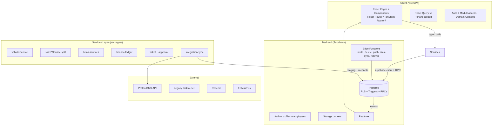

# FLC BI / UBS Webapp Rebuild Roadmap (v2 from Scratch)

**Branch**: `dev-2`  
**Date**: 2026-06-28 (rebase onto latest `main`: 2026-07-25)  
**Status**: Planning complete — Phase 0 additive foundation; branch tip rebased onto production `main`

**Phase 0 Progress** (Foundation):
- Roadmap + data-model skeleton + `supabase/migrations/v2` stub + `@flc/core-types` (roles/scopes/Zod Profile helpers).
- **Do not recreate `@flc/ui` on this branch** — `main` already ships a full `@flc/ui` (and `@flc/auth`, `@flc/shell`, platform/internal-request packages). Phase 0 local UI stub was discarded before rebase to avoid clobbering production UI.
- Workspace: new packages auto-pick via `packages/*`; app adoption of `@flc/core-types` is deferred until Phase 1+ design.
- Blockers: Supabase CLI for real v2 DDL; cutover strategy vs existing migrations; keep changes additive on top of `main`.
- Next: real v2 work on rebased tip (schema design / Phase 1 Vehicle) without discarding July production features.
**Objective**: Clean-slate rebuild of the Unified Business Suite (UBS) for Fook Loi Group car dealership operations. Prioritize correctness, maintainability, scalability, developer experience (DX), and production readiness while retaining proven patterns from the existing system.

This document is the authoritative planning artifact. All future work on `dev-2` references this roadmap. Implementation begins only after explicit approval of next tasks.

---

## 1. Current System Summary

The existing application (`flc-bi`) is a production-deployed Vite + React 18 + TypeScript + Supabase monorepo powering internal operations for Fook Loi Group (FLC) car dealerships across multiple branches/outlets. It manages the full vehicle lifecycle (import → stock → sales → delivery → collections), HRMS, internal requests, purchasing, basic finance/GL, and reporting.

**Key Stats (from discovery)**:
- **109 Supabase migrations** — heavy schema evolution, indicating significant technical debt and churn.
- **~20+ service files** enforcing strict data access layer (no direct `supabase.from()` in pages/components — enforced by ESLint).
- **Comprehensive role system**: App-level roles + HRMS-specific `hrms_roles` + `employee_hrms_role_assignments` + `role_sections` + column permissions + RLS matrix.
- **Multi-source data reality**: Proton DMS (HQ upstream), UBS (local canonical), legacy `fookloi.net` (one-time backfill). Staging tables (`dms_raw_*`, `legacy_staging_*`) and source ledger RPCs exist but integration is incomplete.
- **Proven production elements**: CI (lint, typecheck + RPC contract check, vitest, RLS matrix 86/86, Playwright e2e/accessibility, bundle budget, build), Docker/nginx SPA + Supabase proxy, GHCR deploy via Cloudflare, Sentry, PWA, immutable payment ledger pattern, RPC-heavy complex operations (advisory locks, CTEs), extensive docs (`docs/`, `.ai/PROJECT_CONTEXT.md`).
- **Live domains**: `ubs.protonfookloi.com` (main), `hrms.protonfookloi.com` (HRMS workspace).
- **Strengths to preserve**: Service layer + React Query caching (tenant-scoped keys), module gating (`RequireActiveModule`), error boundaries (per-route + root), HRMS split (shared packages + dedicated `apps/hrms-web`), role/RLS posture, immutable AR/AP events + triggers, extensive testing/CI gates, PWA + offline considerations.
- **Weaknesses/Debt to eliminate in v2**: Migration bloat and lack of schema design phase, some context coupling (DataContext/SalesContext), incomplete DMS/legacy reconciliation (staging only, no live sync worker enforcement), mutable invoice/payment assumptions in places, large single `src/` app despite modules, ad-hoc validation in places, finance/GL foundation incomplete/risky, DX friction from 109 migrations and evolving types, bundle size management via manual chunks, limited observability beyond Sentry.

The system is **not** restarted lightly — v2 reuses the business domain, proven security model, and architectural principles (service ownership of SQL, React Query boundary, RLS as security, RPC for complex writes) but starts with a clean, planned schema and stricter domain boundaries.

**Current Git State (dev-2)**: Clean branch from `dev` (post Phase 5/6 work). No large changes made during discovery.

---

## 2. Existing Modules and Responsibilities

**Core Modules** (from `src/pages/`, `main.tsx` routes, `src/config/routeRoles.ts`, `ModuleAccessContext`):

- **Auto Aging / Vehicle Domain** (`auto-aging/*`): Vehicle stock management, import batches/review/quality issues, SLA policies, branch mappings, commissions, data quality, source ledger (DMS/UBS/legacy), aging reports/KPIs, vehicle detail/explorer. **Central domain** — vehicles table is the heart of the business.
- **Sales** (`sales/*` nested under SalesLayout): Deal pipeline (stages), sales orders (with vehicle linking), customers, invoices, salesman performance/targets/advisors, margin analysis, outstanding collections, dealer invoices, Verify OR. Realtime subscriptions on orders.
- **Inventory** (`inventory/*`): Stock balance, vehicle transfers, chassis movement/filter/search.
- **Purchasing** (`purchasing/*`): Purchase invoices + detail.
- **Accounts / Finance** (`accounts/*`): Chart of accounts, accounting periods, trial balance, journal entries. (GL foundation + immutable payment events pattern).
- **HRMS** (`hrms/*` + dedicated `apps/hrms-web` + `apps/hrms-mobile`): Employees, departments, job titles, leave types/requests/balances (rules: balance, advance notice, day_part half-day), attendance, payroll runs/items, appraisals, announcements, approval flows/instances/decisions, hrms_roles + assignments (categories: executive, hr, department, line_management, staff, payroll, etc.), public holidays, company branding. Self-service + admin. Separate workspace with `HrmsWorkspaceRedirect`.
- **Internal Requests / Portal** (`/portal`, `tickets/*`): Tickets with activity/attachments/comments, categories/subcategories/templates, routing rules (condition-based + priority scoring + pinned flows), approval engine, queue/history/setup (bulk actions, saved views), announcements, documents. CustomerServiceLayout for portal users. Roles: `portal_admin/manager/staff`.
- **Admin** (`admin/*`): User management (invite via edge func, deactivate/reactivate with tombstoning, status), branches, master data (suppliers, dealers, models, colours, payment types, sales_advisors), audit logs, activity dashboard, role permissions/sections, settings (branding, modules, profile), user groups.
- **Reports / Executive**: ReportsCenter, ExecutiveDashboard, notifications, module directory. Custom KPI builder, charts (recharts).
- **Shared/Platform**: Auth flows (login/forgot/reset/signup/verify/account-pending), landing/welcome, notifications, profile/settings redirect.

**Cross-cutting**:
- **Auth & Access**: `AuthContext` (Supabase session + profiles fetch), `ProtectedRoute`, `RequireRole`, `RequireActiveModule`, `isPortalOnlyUser`, `portalAccess.ts`.
- **Data Layer**: `src/services/*` (vehicleService, salesOrder*Service split Crud/Pipeline/Dashboard, ticketService, profileService, hrms*Service, importService, businessReportService, etc.), `packages/supabase`, generated `database.types.ts`.
- **State**: React Query (primary cache), Contexts (Auth, Data, Sales realtime, ModuleAccess, Branding), some LRU in services.
- **Edge Functions** (~6): `invite-user`, `delete-user` (status + ban + audit), `send-push-notification` (FCM/APNs), `dms-sync-worker` (staging only), `rollover-leave-balances`, `update-user-status`.
- **Integrations**: Supabase (Auth, DB, Storage, Realtime, Functions, Storage buckets like company-assets), Sentry, PWA/Workbox, Resend SMTP for auth emails, potential Google Sheets/DMS API (incomplete).

**User Roles** (from `packages/types`, `routeRoles.ts`, `ROLE_DEFAULT_SCOPE`, `deriveHrmsAccess`):
- Global: `super_admin` (bypasses most, company-scoped still via RLS).
- Company: `company_admin`, `director`, `general_manager`, `manager`, `accounts`, `sales`, `analyst` (legacy), `creator_updater` (default).
- Portal: `portal_admin`, `portal_manager`, `portal_staff`.
- HRMS fine-grained via assignments (bypass for super/company_admin).
- Access scopes: global / company / branch / self. Column-level via `column_permissions`.

---

## 3. Business Flow Analysis

**End-to-End Domain Model & Lifecycle** (inferred from code, tables, RPCs, services, workflows):

1. **Identity & Onboarding**:
   - Supabase Auth user created (invite-only, no self-signup in prod).
   - `handle_new_user()` trigger → `profiles` (pending, creator_updater default, company/branch/employee link later).
   - Admin (`invite-user` edge) provisions profile + employee record.
   - Pending/inactive/resigned → redirects or signout. `portal_access_only` → `/portal` or HRMS workspace.
   - Company/branch scoping via RLS + `get_my_access_scope()`.

2. **Vehicle / Inventory Lifecycle** (Core Business):
   - **Sources**: DMS (Proton HQ — sales/stock/orders/allocations/deliveries/collections via `dms-sync-worker` → `dms_raw_*` staging), Legacy (`fookloi.net` — 22k+ customers, invoices, advisors seeded), Direct import batches (Excel/CSV via `commit_import_batch` RPC with quality issues).
   - **Import → Review → Stock**: Batch upload → review queue (quality issues, mappings for payment/branch) → `vehicles` (chassis PK, engine_no, colour, status, branch, salesman_id, milestones, stage, KPIs computed, soft delete, commission fields). Auto-aging, SLA policies, branch_mappings.
   - **Stock Management**: Explorer, detail (link/unlink to sales orders), transfers, chassis filter/movement, commissions dashboard.
   - **Reconciliation**: `auto_aging_source_ledger` RPC (side-by-side DMS/UBS/legacy), `source_reconciliation_*` tables, `seed_source_reconciliation_candidates`.
   - **Edge Cases**: Duplicate chassis, cross-company rejection (RLS tests cover), vehicle linking without duplication (`link_vehicle_to_sales_order` RPC).

3. **Sales Pipeline & Order Lifecycle**:
   - Leads/deals → `deal_stages` (11 stages?), `sales_orders` (with vehicle link, customer, advisor, amounts, dates).
   - `sales_advisors` (code, IC, contact, status, unique per company).
   - Customers, invoices, dealer invoices, Verify OR.
   - Performance: targets, salesman stats, margin analysis, outstanding collections.
   - Realtime on orders. Vehicle linking/unlinking audited.
   - Targets, commissions tied to vehicles/orders.

4. **Finance / Purchasing / GL**:
   - Purchase invoices (detail page live).
   - Immutable ledgers: `payment_events` (AR), `supplier_payment_events` (AP) — append-only, triggers recompute paid_amount/status. No direct client DML.
   - GL: periods, chart of accounts, trial balance, journal entries (ACCOUNTS_AND_UP roles).
   - Invoicing, collections, official receipts (legacy).
   - **Risk noted**: Some surfaces assume mutable totals; v2 enforces immutable from day 1.

5. **HRMS / Workforce**:
   - `employees` (linked to profiles via employee_id), departments, job_titles, status, manager chain.
   - Leave: types (rules: requires_balance, min_advance_notice_days), balances (annual rollover RPC), requests (day_part, attachments), approvals.
   - Attendance clocking, payroll runs/items, appraisals (items), announcements.
   - Org roles (`hrms_roles` with capability flags, authority level) + assignments (is_active, expires).
   - Company branding (logo, colors, storage bucket).
   - Self-service (mobile/web) + admin flows. Approval flows shared with requests.

6. **Internal Requests / Approvals / Ops**:
   - Tickets: create (with form fields/templates), activity (comments, events), attachments (signed URLs), routing via `requestRoutingService` + condition-based `approval_flows` (JSONB conditions, match_priority, pinned per category).
   - Multi-step approvals (`approval_instances`, `approval_decisions`, history).
   - Queue (bulk, saved views), history, setup (categories, subcats, templates, routing rules, attachment settings).
   - Notifications + push (FCM/APNs).
   - Portal-only users isolated to `/portal`.

7. **Reporting & Executive**:
   - Server-side reports (RPCs like `auto_aging_report` with pagination, export cap 10k rows), dashboards (KPI, aging summary, SLA compliance, salesman perf, source ledger).
   - Custom KPI builder, charts.
   - Business reports export (CSV via service).
   - Activity/audit logs.

8. **Admin & Cross-Cutting**:
   - Master data management (suppliers, dealers, models, payment types, etc.).
   - Audit logs, activity, user CRUD with safeguards (no self-delete, last super_admin protection, tombstoning emails).
   - Module toggles (`module_settings`), section visibility overrides (`role_sections`).
   - Push tokens, dashboard preferences, notifications.

**Implicit Assumptions**:
- Company-scoped multi-tenant (RLS primary security).
- Branch-level for managers/sales; self for sales.
- Vehicles identified by chassis (join key across sources).
- Approvals are workflow-driven with conditions/priority.
- DMS is authoritative upstream for HQ data; UBS is local execution + reconciliation layer.
- Immutable events for financial integrity.
- HRMS is semi-independent (shared services/packages but dedicated shell).

**Edge Cases Handled in v1 (preserve/enhance)**: Cross-company rejection, pending user flows, portal-only redirects, advisory locks for batches, single super_admin protection, rate limits on invites, soft-archive on delete.

---

## 4. Proposed Target Architecture (v2 Clean Slate)

**Principles** (strictly enforced in v2):
- **Domain-Driven Design (DDD)**: Bounded contexts per major domain (Vehicle, Sales, HRMS, Finance, Requests, Identity) with dedicated packages/services.
- **Layering (strengthened)**: UI (pages/components) → Services (domain-specific, own SQL shape) → Supabase client/RPCs. No direct DB in UI. Contexts compose services + RQ only.
- **Data Ownership**: Services own queries/mutations. React Query is single cache boundary (tenant + branch + user scoped keys). Immutable events + triggers for finance.
- **Security First**: RLS everywhere (company_id primary). Edge functions for privileged ops (invite, status, push, sync). Column permissions + role matrix. super_admin bypass only via explicit checks.
- **Multi-Source Integration**: Dedicated `integration/` or `sync/` domain with staging + canonical upsert + reconciliation engine. Live workers (edge or separate) for DMS.
- **Observability**: Structured logging, request_id correlation, Sentry + metrics, audit everywhere.
- **DX**: Full type safety (Zod + generated types + tRPC-like if added, or strict RPC contracts), exhaustive tests, automated docs, hot reload, bundle visualization.
- **Scalability**: Tenant isolation, pagination/RPC for large sets, caching (RQ + short LRU), advisory locks for contention, event-driven where beneficial (e.g., notifications on approval).
- **Modularity**: Keep HRMS split (shared packages). Main app as shell + lazy modules. Consider feature flags for gradual rollout.
- **Rebuild Approach**: Green-field schema design first (normalize, plan indexes, RLS policies, triggers upfront). Port business logic/services selectively after schema stable. Preserve UI patterns (StandardTable, forms with Zod helpers, Sonner toasts, error boundaries) but modernize where debt exists.

**High-Level Diagram** (Mermaid — renderable in GitHub/GitLab):



**Monorepo Layout (Improved)**:
```
/ (root)
  apps/
    main/                 # Primary UBS SPA (was src/)
    hrms-web/             # Dedicated HRMS (reuse + enhance)
    hrms-mobile/          # Capacitor (optional keep or web-first)
  packages/
    core-types/           # Shared domain types, roles, Zod schemas
    supabase/             # Typed client, database.types, env
    vehicle/              # Vehicle domain services, schemas, hooks
    sales/                # Sales pipeline services
    hrms/                 # hrms-schemas + hrms-services (split/enhance)
    finance/              # Ledger, GL, payment events
    requests/             # Tickets, approvals, routing
    integrations/         # DMS sync, legacy, notifications
    ui/                   # Shared Radix/Tailwind components, tables, forms
    lib/                  # Pure utils, query client factory, error handling
  supabase/
    migrations/           # Fresh, well-documented, numbered with descriptions
    functions/            # Edge functions (with _shared/)
    config.toml
  docs/                   # This roadmap + ARCHITECTURE v2, RLS_MATRIX v2, etc.
  scripts/                # Bootstrap, seed, verify, deploy
  e2e/                    # Playwright
  .github/workflows/      # CI (enhanced gates)
  Dockerfile, vite.config.ts (root or per-app), package.json (workspaces or pnpm)
```

Use npm workspaces or migrate to pnpm/Turborepo for better caching if scale demands.

---

## 5. Recommended Tech Stack and Project Structure

**Core (Preserve + Minor Upgrades)**:
- **Frontend**: Vite 5+ + React 18 + TS 5.8+ + React Router 6 (or evaluate TanStack Router for type-safe routing) + TanStack Query 5 + Tailwind 3.4 + Radix UI (keep, enhance accessibility) + Zod 3.25 + date-fns + recharts + exceljs + sonner + lucide-react + i18next (if i18n needed).
- **State**: React Query primary; minimal client state via contexts or lightweight (Zustand/Jotai if needed for complex UI).
- **Forms**: react-hook-form + @hookform/resolvers + Zod helpers (standardize `requiredString`, etc.).
- **Build/Dev**: SWC, manual chunks (vendor + feature), PWA plugin, bundle budget check, source maps opt-in.
- **Testing**: vitest + @testing-library + coverage-v8; Playwright for e2e/smoke/accessibility/responsive; dedicated RLS matrix config.
- **Lint/Type**: ESLint 9 (flat), TypeScript strict (enable noImplicitAny etc. in v2), RPC contract checker.
- **Backend**: Supabase (Postgres 15+, Auth, Realtime, Storage, Edge Functions with Deno/TS). Keep self-hosted considerations.
- **Observability**: Sentry (enhanced), structured logs, request_id.
- **Deployment**: Docker (nginx SPA + proxy), GHCR, Cloudflare. CI gates mandatory (no deploy without green).
- **New/Enhanced**: 
  - Strict domain packages with barrel exports and tests.
  - OpenAPI spec or Supabase RPC documentation generation.
  - Better error translation (`errorMessages.ts` enhance).
  - Feature flags / module toggles as code.
  - Performance: Server-side reports/RPCs prioritized, virtualized tables for large lists (if needed beyond StandardTable/ExcelTable).
  - Mobile: Keep Capacitor or pivot to responsive + PWA-first.

**Project Structure Rules (v2)**:
- Every domain has `*-service.ts` (Crud + Pipeline/StateMachine + Dashboard/Aggregations split where complex).
- UI never imports supabase directly (ESLint + import restrictions).
- Shared types in `packages/core-types`.
- Migrations: Descriptive names, up/down where possible, comments, RLS policy in same file or paired.
- Docs: Living ARCHITECTURE.md, SECURITY.md, RLS_MATRIX.md, DATA_MODEL.md, API_CONTRACTS.md.

**Why this stack?** Proven in production, excellent DX with Vite + TS + RQ, Supabase handles auth/DB/realtime/edge without extra servers, Radix + Tailwind for consistent corporate UI (dense grids, thin borders per user preference).

---

## 6. Database/Domain Model Plan

**Approach**: Clean schema design phase first (1-2 weeks). Normalize aggressively. Plan all RLS policies, indexes, triggers, RPCs, views upfront. Generate types early and lock contracts.

**Core Entities** (proposed, refined from existing):

- **Identity/Tenant**: `companies`, `branches`, `profiles` (id=auth.uid(), email, name, role, company_id, branch_id, access_scope, status, employee_id, portal_access_only, ...), `employees` (company_id, branch_id, manager_employee_id, primary_role, status, staff_code, department_id, job_title_id, ...), `user_groups`, `role_sections`, `column_permissions`, `audit_logs`, `notifications`, `push_tokens`, `dashboard_preferences`, `module_settings`.
- **Vehicle Domain**: `vehicles` (chassis PK, engine_no, colour, model, branch_id, salesman_id/employee, status, stage, milestones, KPIs, import_batch_id, source, soft_delete, commission fields, ...), `import_batches`, `quality_issues`, `sla_policies`, `branch_mappings`, `payment_method_mappings`, `commission_rules`, `commission_records`, `vehicle_transfers`.
- **Sales**: `customers` (dedup logic), `sales_orders` (vehicle_id FK or chassis link, customer_id, advisor_id, amounts, dates, stage), `invoices`, `sales_advisors`, `salesman_targets`, `dealer_invoices`, `official_receipts`.
- **Finance/Ledger**: `purchase_invoices`, `payment_events` (append-only AR, immutable), `supplier_payment_events` (AP), `accounting_periods`, `chart_of_accounts`, `journal_entries`, `trial_balance` (view or materialized).
- **HRMS**: `departments`, `job_titles`, `public_holidays`, `leave_types` (rules columns), `leave_balances`, `leave_requests` (day_part, attachments), `attendance_records`, `payroll_runs`, `payroll_items`, `appraisals`, `appraisal_items`, `announcements`, `hrms_roles` (code, category, scope, authority_level, capabilities JSONB), `employee_hrms_role_assignments`, `company_branding`.
- **Requests/Approvals**: `tickets` (category_id, subcategory, template, custom_fields JSONB, attachments), `ticket_activity`, `ticket_attachments`, `request_categories` (approval_flow_id FK), `request_subcategories`, `request_templates`, `request_routing_rules`, `request_form_fields`, `request_attachment_settings`, `approval_flows` (conditions JSONB, match_priority), `approval_steps`, `approval_instances`, `approval_decisions`, `approval_requests`.
- **Integration/Staging** (new dedicated): `sync_runs`, `dms_raw_*` (sales_orders, vehicle_stock, collections, leads, etc.), `legacy_staging_*`, `source_reconciliation_matches`, `source_reconciliation_events`, `dms_master_data`.
- **Other**: `deal_stages`, `models`, `colours`, `payment_types`, `suppliers`, `dealers`, `fees`, etc. (master data).

**Key Patterns (v2)**:
- Every business table: `company_id`, created_at/updated_at/created_by/updated_by (triggers or defaults), soft delete where appropriate.
- Immutable ledgers: REVOKE DML from authenticated; SECURITY DEFINER RPCs + AFTER triggers for aggregates.
- Advisory locks on batch/idempotent ops.
- CTEs for N+1 elimination in reports.
- Generated columns or views for computed KPIs.
- Full-text search indexes where needed (customers, vehicles).
- RLS: `company_id = (SELECT company_id FROM profiles WHERE id = auth.uid())` + branch/self refinements. Helper functions `get_my_access_scope()`, `can_access_row()`.
- Types: Regenerate `database.types.ts` after schema freeze; Zod mirrors for forms/validation.

**Migration Strategy for v2**: New Supabase project or fresh schema in existing (with careful cutover). Numbered migrations with clear descriptions. Initial 10-15 migrations for core domains.

---

## 7. API/Module Breakdown

**Services (packages/domain-*)**:
- Each domain owns: `*CrudService.ts`, `*PipelineService.ts` (state machines, transitions, audits), `*DashboardService.ts` (RPC aggregations, KPIs), barrel export.
- Examples: `vehicleService.ts` (searchVehicles RPC, kpi summaries, import commit, source ledger), `salesOrderService.ts` (link/unlink vehicle RPCs, pipeline), `ticketService.ts` (with routing fallback), `approvalEngineService.ts`, `hrms*Service` (shared), `profileService.ts` (invite/delete/status with safeguards), `importService.ts`, `businessReportService.ts` (10k cap export).
- New: `dmsIntegrationService.ts` (sync worker orchestration, reconciliation), `financeLedgerService.ts` (event append only).

**RPCs/Edge Functions** (preserve + new):
- Existing RPCs (search, reports, link, commit_batch, rollover, source_ledger) → port and harden.
- Edge: invite-user (admin, same-company, rate limit), delete-user (status + ban + tombstone + audit), send-push (scoped), dms-sync-worker (service-role or exec, staging only), rollover-leave, update-user-status.
- New: reconciliation worker, notification fanout, approval engine triggers.

**Data Access Contract**: All pages use services. Services return typed `{ rows, totalCount? }` or domain objects. Mutations invalidate relevant RQ keys.

---

## 8. Frontend/Page Flow Breakdown

**Shell & Navigation**: `AppLayout` (sidebar with module visibility from `role_sections` + DB overrides), `SalesLayout`, `CustomerServiceLayout` (portal). `RequireActiveModule`, `RequireRole` (UX only; RLS is truth).

**Key Flows**:
- Auth: Login → profile fetch → role/company check → redirect (pending → account-pending, portal-only → /portal or HRMS, else dashboard or last module).
- Executive: Dashboard (KPIs, charts, shortcuts) → modules.
- Auto Aging: Dashboard → Explorer (filter/search/paginate) → Detail (link vehicle, history) → Import/Review/Reports.
- Sales: Pipeline (drag-drop stages?) → Orders (create/link vehicle) → Customers/Invoices/Performance.
- HRMS: Workspace redirect → Leave calendar/requests (self + approvals), Payroll, Appraisals, Admin setup.
- Requests: New ticket (template-driven form) → Queue (bulk/approvals) → History.
- Admin: Users (invite/table with status actions), Master Data, Audit, Settings (branding, modules, profile self-edit).
- Reports: Center with export (warn on cap).

**UI Patterns to Standardize**: `StandardTable` (sort, filter, paginate, selection, bulk), `ExcelTable` for large, Zod form helpers, Sonner toasts with error translation, per-route `RouteErrorBoundary`, `PageSpinner`, lazy loading everywhere.

**Accessibility/Responsive**: Playwright gates, axe-core, mobile-first where portal/HRMS self-service.

---

## 9. Authentication and Authorization Plan

**Auth Flow (v2)**:
- Supabase Auth (email/password, PKCE, invites). `VITE_SUPABASE_URL/ANON_KEY`. Storage key `flc.auth.session`.
- `AuthContext`: Session + `fetchProfile` (only auth when profile + company_id + active). Preserves invite/reset sessions.
- Redirects: No profile/company → pending; inactive/resigned → signout; portal_only → /portal or HRMS workspace.
- Password recovery: 1h single-use, custom template pointing to `/reset-password`.
- Edge `invite-user`: super/company_admin only, same-company, no super_admin grant, rate limit 10/h.
- `delete-user` / status: Safeguards (self, last super, signed-in until inactive, tombstone email, ban best-effort, audit).

**Authorization**:
- Roles in `profiles.role` + `employees.primary_role` (default creator_updater).
- Route groups centralized (ADMIN_ONLY, EXECUTIVE, MANAGER_AND_UP, ACCOUNTS_AND_UP, HRMS_*, PORTAL_*).
- HRMS: `useHrmsAccess` + `deriveHrmsAccess()` from assignments; super/company_admin bypass to full.
- UI: `RequireRole`, section visibility (role_sections DB overrides).
- RLS: Company primary; branch/self refinements. Column permissions via service/hook.
- Edge functions: Explicit JWT + same-company checks.
- Audit: Every privileged action (user status, invites, approvals, deletes).

**Portal/HRMS Isolation**: `portalAccess.ts`, dedicated layouts, workspace redirects.

---

## 10. Implementation Milestones (Priority Order)

**Phase 0: Foundation (1-2 weeks)** — Schema design, core packages, auth/tenant, CI skeleton, docs.
1. Fresh Supabase local stack + initial migrations (identity, vehicles, sales core, RLS policies, helpers, triggers for immutable).
2. `packages/core-types`, `packages/supabase`, `packages/ui`.
3. AuthContext + profile fetch + role helpers + ProtectedRoute.
4. Basic Vite app shell, layouts, error boundaries, query client.
5. CI workflow (lint, typecheck, unit, RLS seed/test, build, e2e smoke).
6. Bootstrap admin script, RLS test users.

**Phase 1: Vehicle + Import Domain (Core)** (2 weeks)
- Vehicle services, explorer, detail, import center/review/quality.
- RPCs for search, kpi, commit_batch, source ledger.
- StandardTable + filters.
- DMS/legacy staging skeleton + reconciliation basics.

**Phase 2: Sales Pipeline** (2 weeks)
- Deal pipeline, orders (with vehicle link/unlink), customers, invoices, advisors, performance.
- Realtime, pipeline state machine.
- SalesLayout, margin/outstanding.

**Phase 3: HRMS Core** (2-3 weeks)
- Employees, leave (types, balances, requests with rules/approvals), attendance, appraisals, announcements.
- hrms_roles + assignments.
- Shared packages + hrms-web shell (reuse main auth/providers).
- Self-service flows + mobile considerations.

**Phase 4: Requests + Approvals** (2 weeks)
- Tickets, categories, routing (conditions, priority, pinned), approval engine/instances.
- Queue, history, setup, attachments, notifications/push.
- Portal layout + roles.

**Phase 5: Finance + Purchasing + GL** (2 weeks)
- Purchase invoices, immutable payment events + triggers.
- GL (periods, COA, journals, trial balance).
- Enforce immutable patterns strictly.

**Phase 6: Reports, Admin, Executive, Polish** (2 weeks)
- ReportsCenter, ExecutiveDashboard, notifications.
- Admin (users, master data, audit, settings, branches, role-permissions).
- Inventory transfers, chassis features.
- Branding, module toggles, custom KPIs.
- Export (warn on cap), bundle budget, PWA.

**Phase 7: Integration, Deploy, Hardening** (1-2 weeks)
- Full DMS sync worker + reconciliation.
- Edge functions complete.
- Production verification scripts, smoke tests, RLS matrix full.
- Docker/CI deploy pipeline, Cloudflare.
- Performance, security review, DR/backup.
- Documentation completion (DATA_MODEL, API_CONTRACTS, RUNBOOKS).

**Total Estimate**: 12-16 weeks for MVP parity + improvements. Parallelize where domains independent (HRMS can run alongside vehicle/sales).

**Priority**: Vehicle/Sales/HRMS first (business critical), then requests/finance.

---

## 11. Testing Strategy

- **Unit**: vitest on services, hooks, utils, components (target >80% coverage on new code). Test services in isolation with mocked Supabase.
- **Integration/Contract**: RPC contract checker (existing script). Service tests with real local Supabase where possible.
- **RLS Matrix**: Dedicated config (`vitest.rls.config.ts`), seed script, 100% coverage of cross-company, branch, self, admin bypass, status edge cases. Run on every PR.
- **E2E**: Playwright — smoke (all major routes), accessibility (axe), responsive, critical flows (login → dashboard → create order/ticket/leave, approval, import). Dedicated e2e/ folder.
- **Visual/Regression**: Optional Percy or built-in screenshot tests for key tables/dashboards.
- **Performance**: Bundle budget, Core Web Vitals to Sentry, load testing on reports.
- **Security**: Edge function checks, RLS sign-off, column permissions tests.
- **CI Gates**: All must pass before merge/deploy. Optional RLS on push.
- **Manual**: Production smoke (`npm run smoke:production`), verify scripts.

**v2 Enhancement**: Property-based testing for complex rules (leave balances, approval matching), contract tests between services and DB.

---

## 12. Migration or Compatibility Considerations

- **Data Migration**: Plan cutover from existing Supabase. Use staging + reconciliation to backfill historical data. Preserve legacy IDs where possible.
- **Schema Compatibility**: v2 schema is new but informed by existing tables. Provide mapping doc. Use views for transitional queries if needed.
- **API Compatibility**: Services provide stable interface; internal consumers (hrms-web, mobile) update to new packages.
- **Auth/Profiles**: Preserve existing profiles during cutover; status/employee links intact.
- **Deploy**: Blue/green or canary via Cloudflare. Feature flags for modules.
- **Rollback**: Git + DB PITR. Documented in BACKUP_DR.md.
- **No Destructive**: Never run destructive on prod without explicit request. CI builds only for Docker.

**Compatibility Layer**: Temporary adapters in services during transition if needed.

---

## 13. Risks, Unknowns, and Assumptions

**Risks**:
- DMS API access/credentials (unknown exact endpoints, auth, rate limits — discovery needed).
- Production Supabase self-hosted specifics (Edge Runtime function config, APNs secrets, SMTP).
- Performance at scale (22k+ customers, high vehicle volume, concurrent approvals) — RPC + pagination mitigate.
- Approval complexity (condition JSONB matching, multi-flow priority) — test thoroughly.
- Finance immutable enforcement (existing surfaces may assume mutability).
- Team velocity on clean schema vs. porting.
- Bundle size / chunking complexity in large monorepo.

**Unknowns**:
- Exact DMS integration contract (current is staging-only).
- Full legacy data volume/quality.
- Specific user pain points beyond discovery (e.g., mobile HRMS usage).
- Exact number of outlets/branches.

**Assumptions**:
- Business requirements stable (vehicle-centric dealership ops, multi-source, HRMS + requests).
- Supabase remains backend (or evaluate alternatives if cost/performance issues).
- User prefers corporate spreadsheet-like dense UI (preserve).
- CI/deploy pipeline works (proven).
- No public signup; invite-only.
- Company_id tenant is sufficient (no global cross-company reporting beyond super_admin).

**Mitigations**: Early DMS discovery task, extensive RLS/property tests, incremental rollout, strong docs.

---

## 14. Suggested Delivery Checkpoints

- **Checkpoint 0 (End of Phase 0)**: Core schema + auth + shell + CI green. Local dev fully functional for new users.
- **Checkpoint 1 (Phase 1+2)**: Vehicle explorer + sales orders/pipeline working end-to-end with vehicle linking. Import/review basic.
- **Checkpoint 2 (Phase 3+4)**: HRMS leave/requests + approvals + portal flows live. Shared packages stable.
- **Checkpoint 3 (Phase 5+6)**: Full finance + reports + admin. Executive dashboard with real KPIs.
- **Checkpoint 4 (Phase 7)**: DMS integration complete, production deploy verified (smoke 100%, RLS matrix, performance), docs signed off.
- **Final**: v2 parity + improvements deployed to `ubs.protonfookloi.com`. Legacy `fookloi.net` decommissioned. Ongoing maintenance on `main`.

Each checkpoint includes: passing tests, updated docs (ARCHITECTURE, RLS_MATRIX, DATA_MODEL, RUNBOOK), production verification script run, stakeholder demo.

---

## 15. Clear Next Development Tasks After the Roadmap

**Immediate (Post-Roadmap Approval)**:
1. **Setup**: `git checkout dev-2 && npm install` (or pnpm), `supabase start` (local), verify `npm run typecheck && npm run lint && npm run test`.
2. **Schema Design Workshop**: Review existing 109 migrations + tables. Design v2 normalized schema in `supabase/migrations/0000_...` (new numbering). Document in `docs/DATA_MODEL.md`.
3. **Core Packages**: Scaffold `packages/core-types/src/index.ts` (AppRole, domain types, Zod schemas), `packages/supabase`, `packages/ui` (StandardTable, forms, ErrorBoundary, etc.).
4. **Auth Foundation**: Port/refine `AuthContext.tsx`, `ProtectedRoute`, profileService basics, routeRoles. Add strict TS.
5. **CI Skeleton**: Update `.github/workflows/ci.yml` with v2 gates. Add bundle visualization.
6. **Discovery Follow-up**: If blocked — request DMS API docs/credentials, production Supabase access details, or user confirmation on specific workflows (e.g., exact deal stages, approval examples).
7. **First Milestone Ticket**: Implement vehicle domain services + basic explorer page (using new structure).

**Blocked Scenarios** (per instructions — stop and clarify):
- Missing DMS API credentials/endpoints.
- Inaccessible production Supabase or deploy keys.
- Destructive ops needed (e.g., prod DB reset).
- Ambiguous business rules not inferable from code (e.g., exact approval condition examples, commission calculation formulas).

**Autonomous Continuation**: Once above complete, proceed to Phase 0 implementation unless user intervenes. All changes tracked in `dev-2`. Roadmap updates via PRs with justification.

---

**Appendix: Useful References from Discovery**
- `docs/ARCHITECTURE.md`, `docs/SECURITY.md`, `docs/RLS_MATRIX.md`, `docs/DEVELOPMENT_PLAN.md`, `PHASE5_...md`, `UI-UX-IMPLEMENTATION-PLAN.md`.
- `.ai/PROJECT_CONTEXT.md` (authoritative runtime context).
- `src/main.tsx` (full route map), `src/config/routeRoles.ts`, `packages/types`.
- `supabase/migrations/` (109 files — study for patterns).
- `vite.config.ts` (chunking), `package.json` (deps), services examples.
- Production verification: `npm run verify:production`, `npm run smoke:production`.

This roadmap ensures a strong, correct foundation. Implementation will be incremental, tested, and documented. Ready for review and next steps.

---

*End of Roadmap. Committed to `dev-2` as `docs/development-roadmap.md`.*
